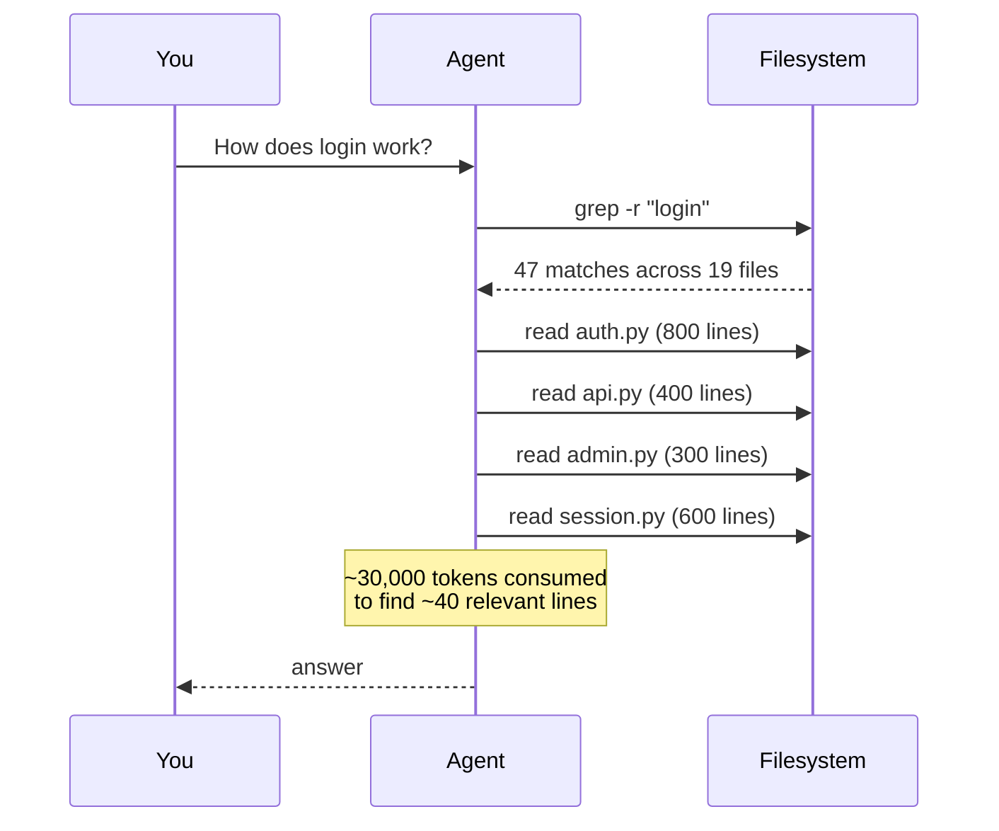
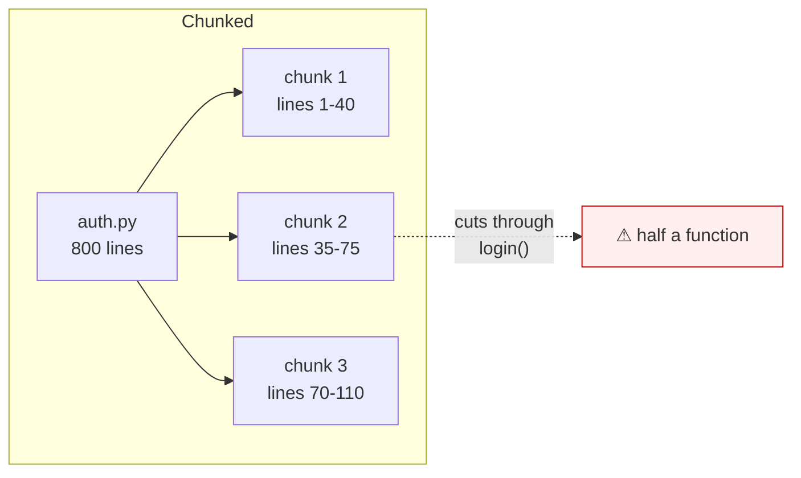
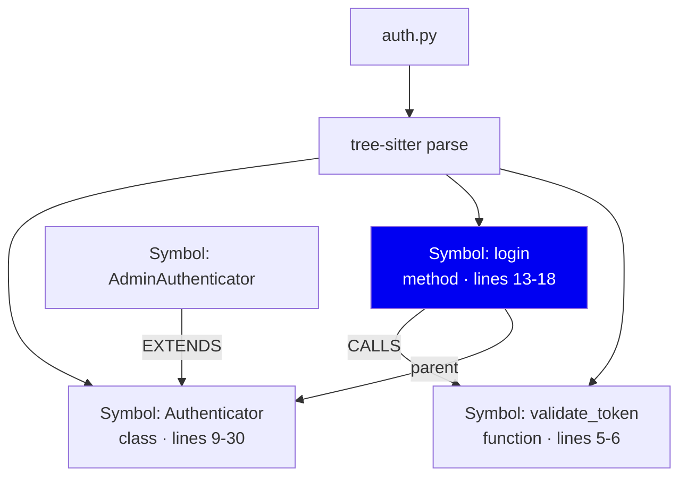

# 01 · Why a symbol graph (and not chunks)

> **Read this first.** Every other design decision in this codebase follows
> from the argument here.

---

## The problem

You ask a coding agent: *"How does login work?"*

Without an index, it does this:

Three things went wrong, and they are all the same thing:

1. **The agent paid for whole files** when it needed three functions.
2. **It had to guess which files** — grep matches text, not meaning.
3. **It couldn't follow relationships.** To learn what `login` calls, it had to
   read `login`, extract names by eye, and grep again.

The information it needed — *"`login` is defined here, it calls these two
functions, and this class overrides it"* — is fully determined by the source
code. It's just not written down anywhere the agent can query.

**symbolgraph writes it down.**

---

## First principles: what is actually true about code?

Forget retrieval for a moment. What do we know for certain about a source file?

**Fact 1 — Code has a grammar.** Unlike prose, a program has an unambiguous
parse. `def login(...)` is a function definition. This isn't a guess; a parser
can prove it.

**Fact 2 — Definitions have boundaries.** A function starts and ends at
specific bytes. There's a *correct* answer to "where does this function end",
and it is not "512 tokens later".

**Fact 3 — Code refers to other code.** `login()` calling `validate_token()` is
a real, directed, typed relationship. Programs are graphs.

**Fact 4 — Identity is stable across edits.** Add a comment above `login` and
it's still `login`. Its byte offsets changed; the thing itself did not.

Now the design question: **which of these facts does a given retrieval design
preserve?**

---

## Why chunk-based retrieval loses

The standard RAG approach: split files into fixed-size overlapping windows,
embed each, retrieve by cosine similarity.

Against our four facts:

| Fact | Chunking | Cost |
|---|---|---|
| Code has a grammar | **Ignored** — splits on token count | A chunk boundary can land mid-expression |
| Definitions have boundaries | **Ignored** | You retrieve the middle of a function and call it context |
| Code refers to code | **Lost** | Callers/callees need a second search, and text similarity is a bad proxy for "calls" |
| Identity is stable | **Lost** | Edit one line → offsets shift → re-chunk and re-embed the file |

The deepest problem is the last one. If chunk identity is *"file X, bytes
1000–1500"*, then inserting a line at the top changes the identity of every
chunk below it. The system cannot tell "this changed" from "this is new", so
incremental indexing degrades into re-indexing.

**This is not a claim that embeddings are bad.** We use them too (see
[08-retrieval](08-retrieval.md)). The claim is narrower: *the chunk boundary
should follow the language's own structure, because that structure is free,
exact, and already there.*

---

## What we build instead

A **symbol** is a complete definition with a stable identity. An **edge** is a
typed, directed relationship the parser proved exists. Retrieval returns
symbols and their edges, so *"what calls this"* is a graph lookup, not a
second search.

The four facts, preserved:

| Fact | How |
|---|---|
| Grammar | tree-sitter parses to a real AST ([02](02-ingestion-and-parsing.md)) |
| Boundaries | A chunk is exactly one definition ([05](05-chunking-and-embedding.md)) |
| Relationships | Typed edges, resolved cross-file ([04](04-resolution-and-relationships.md)) |
| Stable identity | `stable_key` survives edits ([03](03-symbols-and-identity.md)) |

---

## What else we could have used

Genuine alternatives, and honest reasons for not choosing them:

### Language Server Protocol (LSP)

Real compilers, exact resolution, full type information. Strictly more accurate
than what we do.

**Why not:** an LSP server per language, each needing a configured project that
builds. `gopls` wants a valid module; `tsserver` wants `tsconfig.json`;
`pyright` wants an environment. For a tool that must work on *any* checkout in
under a second, that's a hard dependency chain. We accept lower accuracy for
"works immediately on a repo you just cloned".

**What it costs us:** no type inference. We resolve `auth.login()` by name and
scope, not by knowing `auth`'s type. Genuinely worse on heavily dynamic code.

### ctags / universal-ctags

Fast, mature, language-coverage is excellent.

**Why not:** ctags gives you *definitions*, not *relationships*. It answers
"where is `login` defined" but not "what calls `login`". Half our value is the
edges.

### Pure vector search over whole files

Simplest possible thing.

**Why not:** file-granularity retrieval means whole-file context, which is the
cost we're trying to remove. And embeddings alone are weak at exact-symbol
lookup — asking for `validate_token` should not be a fuzzy similarity problem.

### A real graph database (Neo4j, etc.)

The data *is* a graph, so this is a fair question.

**Why not:** it's a server. `symbolgraph` must run as a local CLI with no
daemon, no port, no install step beyond `pip`. SQLite is in-process and
ships with Python. Our graph queries are shallow (1–2 hops), which SQLite
handles fine — we are not running PageRank.

**What it costs us:** deep traversals would be painful. We don't do them.

---

## The honest limitation

The value depends on file size, and we measured it rather than assumed it.

A context pack has fixed structural overhead (~800 tokens). On a file *smaller*
than that, packing costs more than just sending the file:

| Baseline file size | Measured saving |
|---|---|
| > 4k tokens | **90–94%** |
| 1k – 4k tokens | 53–66% |
| < 1k tokens | **−21% to −293%** (i.e. a loss) |

So the accurate claim is: **symbolgraph pays off on files large enough that
reading them whole is expensive — which is exactly where agents struggle.** On
a tiny repo of small files it will cost you tokens.

Details and methodology in [12-evaluation](12-evaluation.md).

---

## Summary

| | Chunked retrieval | symbolgraph |
|---|---|---|
| Unit | N-token window | One complete definition |
| Boundary | Token count | Language grammar |
| Relationships | Re-search by text | Typed edges, already stored |
| Identity | Byte offsets | `stable_key`, survives edits |
| Incremental | Re-embed the file | Skip unchanged files entirely |
| Cost on big files | Whole file | Definition + neighbours |
| Cost on tiny files | Cheap | **More expensive** |

**Next:** [02 · Ingestion & parsing](02-ingestion-and-parsing.md)
