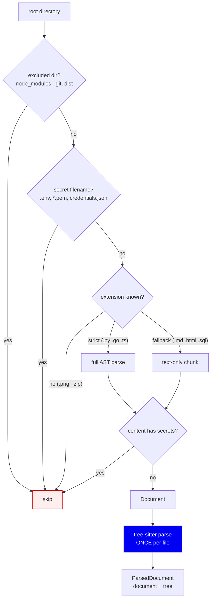
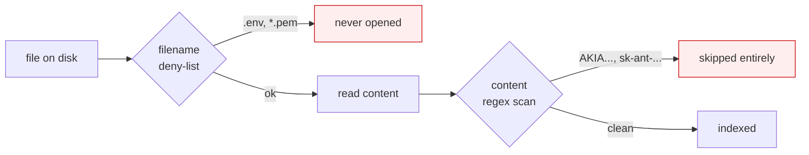
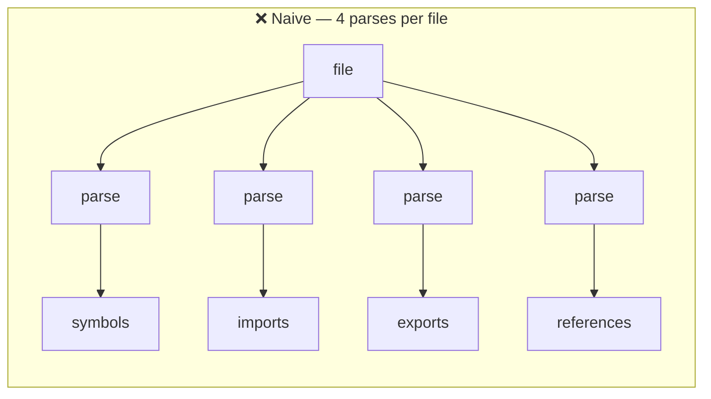
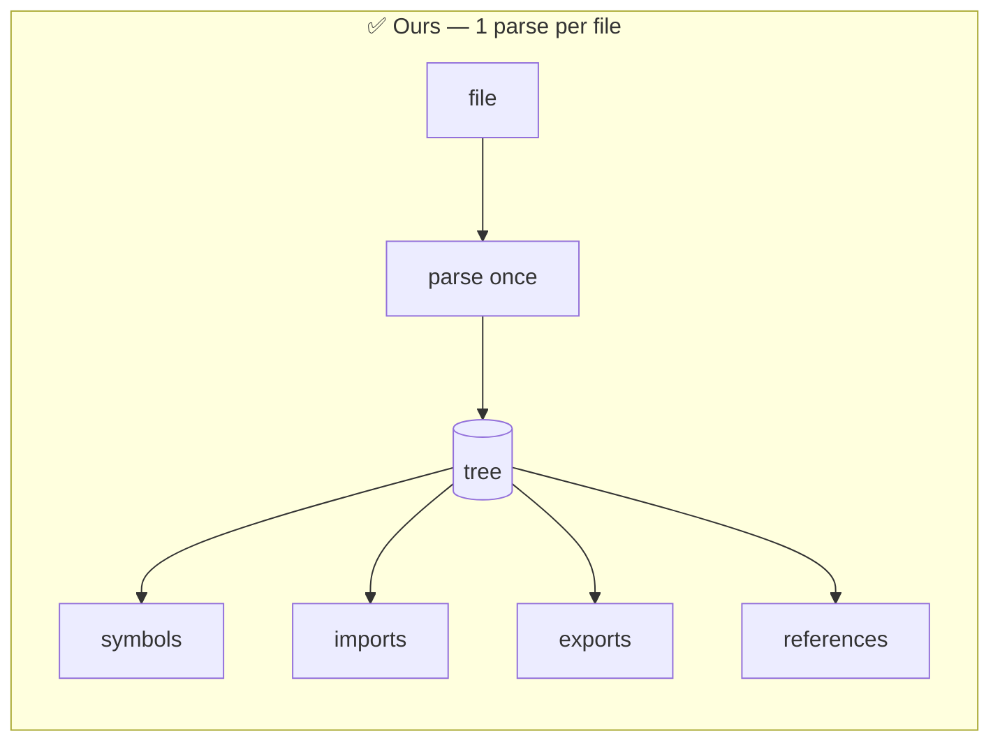

# 02 · Ingestion & Parsing

**Phase 1–2 of the write path.** Turning "a directory on disk" into "a set of
syntax trees we can reason about".

---

## The problem

Before analysing anything you must answer three unglamorous questions:

1. **Which files?** A repo contains `node_modules/`, build output, images,
   and a 40MB vendored library. Indexing all of it is slow and useless.
2. **Is it safe to read?** A `.env` file contains live credentials. If we index
   it, those credentials end up in a database and later in an LLM's context.
3. **How do we understand it?** A `.py` file and a `.md` file need very
   different treatment.

Get these wrong and everything downstream is wrong — but expensively, because
you only find out after parsing 10,000 files.

---

## The flow



Entry point: `ingestion/loader.py` → `iter_repo_files()`.

---

## Decision 1 — Two tiers of language support

Not all files deserve the same effort. We split them:

| Tier | Count | What happens | Example |
|---|---|---|---|
| **Strict** | 17 extensions | Full tree-sitter parse → symbols, edges, imports | `.py .ts .tsx .js .jsx .go .rs .java .cs .c .h .cpp .hpp .cc .hh .cxx .hxx` |
| **Fallback** | 26 extensions | Indexed as one text chunk, searchable, no AST | `.md .html .css .json .yaml .sql .sh .rb .php .swift .kt ...` |
| **Ignored** | everything else | Not read at all | `.png .zip .pdf` |

Defined in `symbolgraph/config.py`; the gate is `ingestion/loader.py:24`.

**Why a fallback tier at all?** Because a repo isn't only code. A question like
*"where is the CI workflow defined"* should find `ci.yml`. Giving up on
non-code files entirely would make the tool feel broken. But writing a symbol
extractor for YAML is not worth it — so those files get one chunk and full-text
search, and we're honest that they have no graph.

**Alternative considered:** treat everything as text. Simpler, but then Python
files lose their structure — that's the whole product.

**Tradeoff:** a two-tier system means two code paths, and the fallback path has
genuinely worse retrieval. We accept it because the alternative is worse in
both directions.

---

## Decision 2 — Redact secrets *before* indexing, not after

This is a **security boundary**, and its placement matters.



Two layers, in `indexing/secrets.py`:

1. **Filename deny-list** (`is_secret_filename`) — `.env*`, `credentials.json`,
   `secrets.yml`, `.pem` / `.key` / `.p12` / `.jks`. These are never opened.
2. **Content scan** — 15 regexes for AWS keys, GitHub tokens (`ghp_`,
   `github_pat_`), Slack, Stripe, OpenAI/Anthropic/Google keys, JWTs, private
   key blocks, plus a generic `PASSWORD=`/`TOKEN=` pattern.

Plus PII redaction: emails, IPv4, phone numbers, SSNs, and card numbers that
pass a **Luhn check** (so `4111 1111 1111 1111` is redacted but a random
16-digit number is not).

**Why before, and not at query time?** Because the index is a file on disk that
outlives the process. If a secret enters `.sg/index.sqlite`, it is now in a
second place, and any future bug that reads the index leaks it. Filtering at
the boundary means the secret never exists in our storage at all.

**You can watch this work on this repo:**

```
$ sg index .
Skipping .../indexing/secrets.py: contains secrets
```

The file containing the example patterns matches its own regexes. It is
excluded rather than redacted in place — **files on disk are never modified.**

**Tradeoff:** false positives. A file full of example keys (like our own
`secrets.py`) becomes unsearchable. We chose that over the alternative failure
mode, which is leaking a real credential.

---

## Decision 3 — "Parse once" is an invariant, not an optimisation

This is the most important rule in the write path.

Extraction needs the AST many times: once for symbols, once for imports, once
for exports, once for references. The naive implementation re-parses per pass:





`analysis/pipeline.py` parses in `run_parse_pass`, stores results on the
context, and every later pass reads `context.parsed_documents`. Parsing is the
single most expensive step, so this is roughly a 4× difference on the dominant
cost.

**It is pinned by a test**, because an invariant nobody checks is a comment:

> `tests/test_parse_pass.py` — feed 2 documents through the pass sequence,
> assert `TreeSitterParser.parse` was called **exactly twice**.

Without that test, a future contributor adds a pass, calls `parse()` "just for
this one thing", and the regression is invisible until someone profiles a large
repo.

---

## Why tree-sitter?

| Option | Verdict |
|---|---|
| **tree-sitter** ✅ | One API, ~11 grammars, error-tolerant, no build step, fast |
| Python `ast` module | Python only. We'd need 8 more parsers with 8 different APIs |
| Regex | Cannot handle nesting. Fails on the first string containing `def ` |
| Full compiler frontends | Most accurate, but needs a *buildable* project — see [01](01-why-symbol-graph.md) |

The decisive property is **error tolerance**. tree-sitter produces a usable
tree from a file that doesn't compile — half-written code, a syntax error, an
unsupported language feature. Since developers index code *while editing it*,
a parser that refuses broken input would fail constantly.

**Tradeoff:** tree-sitter gives syntax, not semantics. It tells us `login` is a
method and `validate_token()` is a call; it does **not** tell us which
`validate_token` that resolves to. That's the next phase's job, and it's why
our resolution is heuristic rather than exact.

---

## The pinned-version subtlety

`pyproject.toml` pins `tree-sitter>=0.25.2,<0.26`, and the comment explains why:
the grammar packages (`tree-sitter-c==0.24.1`, etc.) are compiled against the
0.25 ABI. Mixing a 0.26 core with 0.25-ABI grammars **corrupts memory** when
reading `Node.start_point`.

This was not theoretical — an unbounded `uv tool install` on the dev machine
had already resolved `tree-sitter==0.26.0` before the cap was added. Native
extensions don't fail politely at the boundary; they segfault later.

---

## Summary

| Decision | Why | Cost |
|---|---|---|
| Two language tiers | Non-code files still matter, but don't deserve a parser | Two code paths |
| Secrets filtered at read time | The index outlives the process | False positives block real files |
| Parse once, enforced by test | Parsing dominates cost | Passes must share a context |
| tree-sitter | Multi-language + error tolerant | Syntax only, no types |
| Pinned ABI range | Version mix corrupts memory | Manual bumps |

**Next:** [03 · Symbols & identity](03-symbols-and-identity.md)
