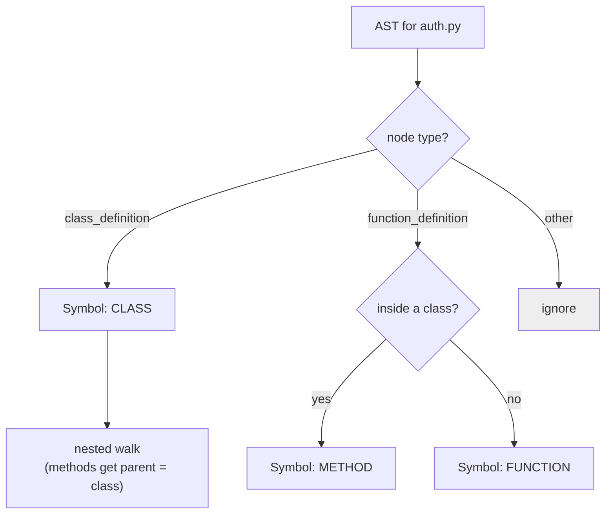
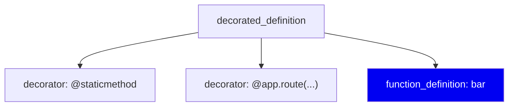
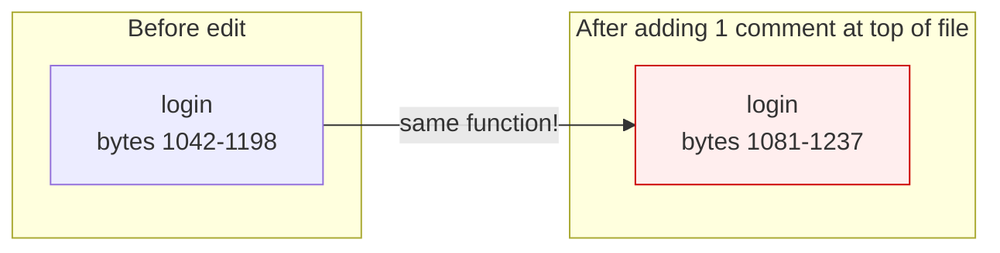
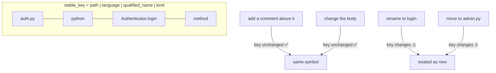
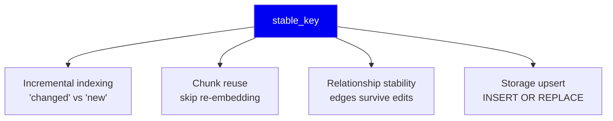

# 03 · Symbols & Identity

**Phase 3 of the write path.** Turning a syntax tree into named things that keep
their names.

> This is the document to read carefully. **Identity is the hardest problem in
> the system**, and almost every other feature depends on getting it right.

---

## Part A — Extracting symbols

A tree-sitter AST has hundreds of node types. We care about a handful: things
that *define* something a developer would search for.



### The handler registry

Rather than one giant `if node.type == ...` switch, dispatch is table-driven:

- `analysis/registry.py` maps `(language, node_type) → handler`
- Handlers live in `analysis/symbol_handlers/` — one small file each
  (`python_function.py`, `rust_trait.py`, `go_type.py`, ...)

**Why a registry?** Adding a language means adding files, not editing a
central switch that every language shares. ~90 files in `analysis/` sounds
like a lot until you realise it's 8 languages × several node kinds each, and
each file is 20–40 lines you can read in one sitting.

**Tradeoff:** indirection. To answer "what happens to a Python function" you
must know to look in the registry first. We accept that for isolation — a bug
in Rust handling cannot break Python.

### Example: Python decorators

`analysis/symbol_handlers/python_function.py` handles a real awkwardness.
tree-sitter does **not** put decorators inside the function node:



The decorators are *siblings* of the function, wrapped in a parent
`decorated_definition`. So `_decorators_of()` walks **up** to the parent and
collects siblings — you cannot find them by looking down from the function.

This is typical of AST work: the shape is what the grammar author chose, not
what you'd expect. **Always print the real tree before writing a handler.**

---

## Part B — Identity, the load-bearing idea

Now the hard part. Every symbol needs an ID. What should it be?

### Attempt 1 — Byte offsets

`auth.py:1042-1198`



**Broken.** Add one line at the top of the file and every symbol below it gets
a new identity. The system now believes you deleted and recreated the entire
file. Incremental indexing is impossible.

### Attempt 2 — Hash of the source text

`sha256(function_body)`

**Broken differently.** Now identity changes whenever you *edit* the function —
which is exactly when you most want to say "this same function changed". You
cannot distinguish "modified" from "deleted + added".

### Attempt 3 — What we actually use

```python
# analysis/fingerprints.py:14
stable_key = f"{relative_path}|{language}|{qualified_name}|{kind}"
```

A real example:

```
auth.py|python|Authenticator.login|method
```



**What it deliberately excludes:** line numbers, byte offsets, the body text,
and (added later) decorators. None of those describe *what the symbol is*.

**What it includes and why:**

| Component | Why it's needed |
|---|---|
| `relative_path` | Two files can both define `login` |
| `language` | A polyglot repo can have `auth.py` and `auth.go` |
| `qualified_name` | `Authenticator.login` ≠ `AdminAuthenticator.login` |
| `kind` | A `class Config` and a `def Config` can coexist |

### The additive-field rule

When `Symbol.decorators` was added, the deliberate constraint was that
`qualified_name` and `stable_key` **must not** depend on it — and there's a
test asserting exactly that:

> `tests/test_python_pipeline.py::test_decorators_do_not_affect_qualified_name_or_stable_key`

**Why?** Adding `@staticmethod` to a method would otherwise change its
identity, so every caller resolution pointing at it would silently break. The
general rule: **identity may only depend on what makes the symbol *that*
symbol.** Attributes go in fields, never in the key.

---

## Why identity matters so much



Every one of those breaks if identity is unstable. This is why a one-line
function in `fingerprints.py` gets its own section in the docs.

---

## The known weakness — renames

`stable_key` includes the name, so **renaming a symbol looks like delete +
add.** Its edges are rebuilt rather than carried over.

**Could we do better?** Yes, in principle — content-similarity matching
("a symbol with an identical body appeared as `logIn` in the same file the
same commit `login` disappeared, so it's probably a rename"). That's how git
detects renames.

**Why we don't:** it's heuristic, it can be wrong, and being wrong means
silently attributing one symbol's history to another. The cost of the current
behaviour is one extra re-index of the affected file. That's cheap. We chose
the boring correct thing.

**This is a deliberate limitation, not an oversight.**

---

## Summary

| Decision | Why | Cost |
|---|---|---|
| Table-driven handler registry | New languages = new files, not edits to shared code | Indirection |
| Identity excludes position | Position changes constantly, meaning doesn't | — |
| Identity excludes body | Need to distinguish "edited" from "replaced" | — |
| Identity = path+lang+qname+kind | The minimum that makes a symbol *that* symbol | Renames look like delete+add |
| New fields must not touch the key | Otherwise attributes silently break resolution | Enforced by test |

**Next:** [04 · Resolution & relationships](04-resolution-and-relationships.md)
