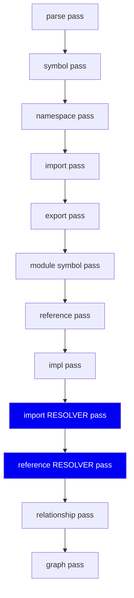
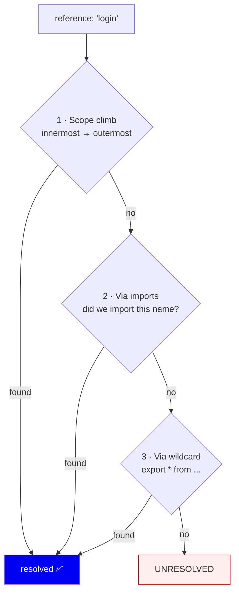
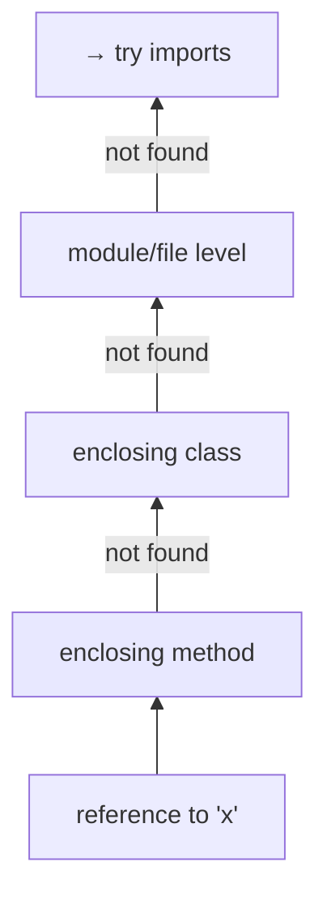
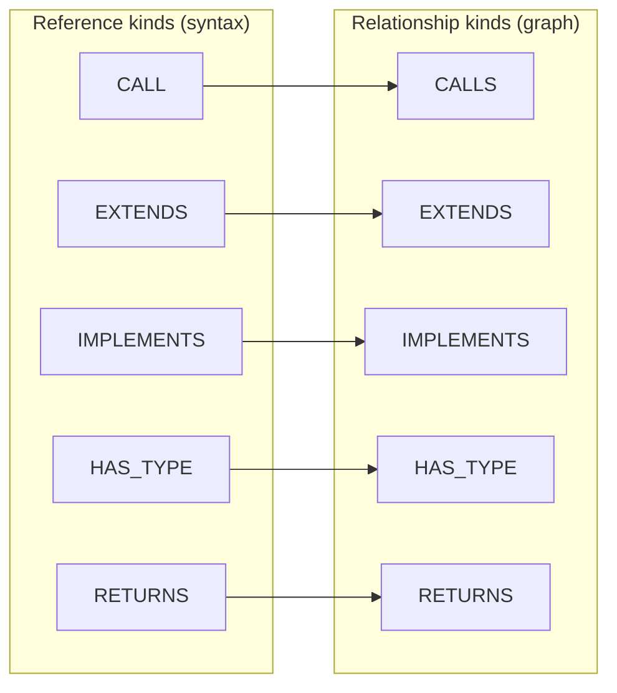
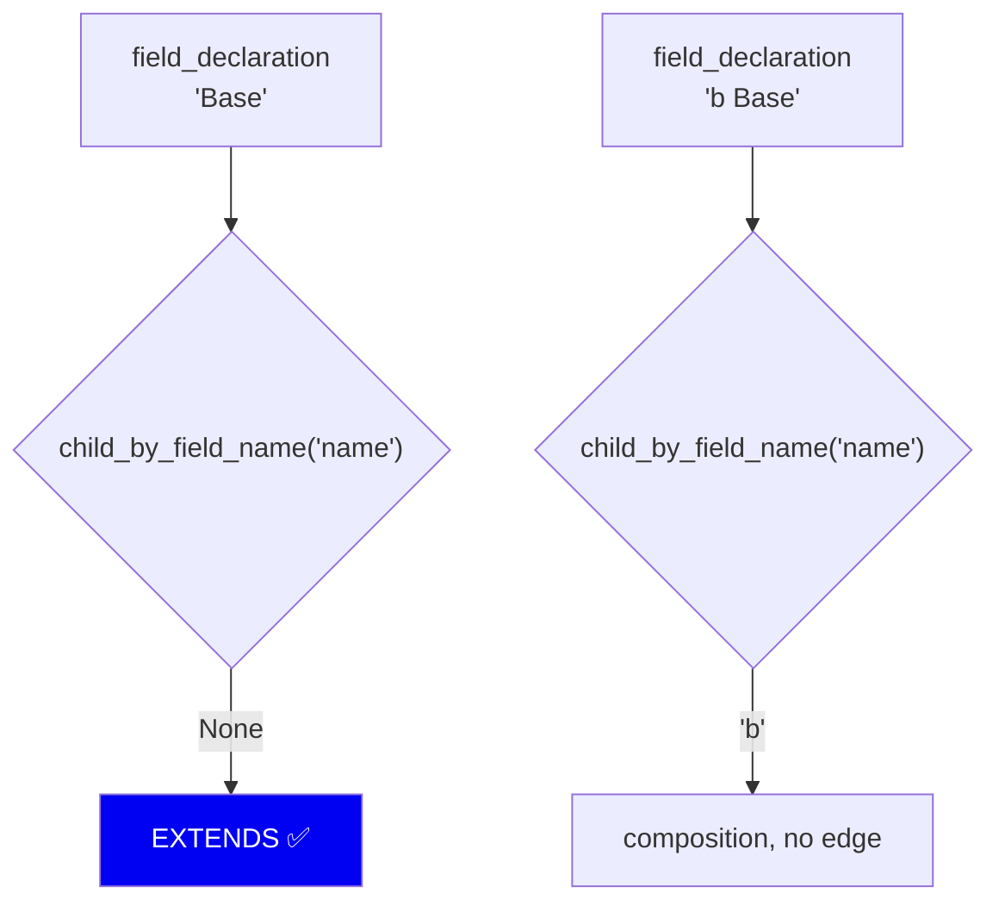
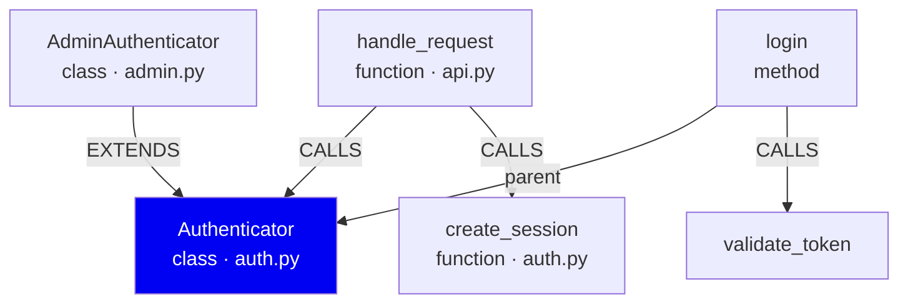

# 04 · Resolution & Relationships

**Phases 4–5 of the write path.** Turning "a name appears here" into "this name
means *that* symbol", then into typed edges.

---

## The problem

The parser gives us syntax, not meaning. It sees:

```python
def handle_request(user, token):
    auth = Authenticator("s3cret")
    return auth.login(user, token)
```

and reports: *"there is an identifier `Authenticator` here, and a call to
`login` here."* It does **not** know:

- Which `Authenticator`? This file's? An imported one? There might be three.
- Which `login`? `Authenticator.login` or `AdminAuthenticator.login`?

Answering that is **name resolution**, and it is where most of the difficulty
in this codebase lives.

---

## Pass ordering is not arbitrary



From `analysis/pipeline.py`. Two ordering constraints are load-bearing:

1. **All symbols before any resolution.** You cannot resolve a name to a symbol
   in a file you haven't read yet. Extraction is per-file; resolution is
   whole-repo. This is why they are two separate function calls
   (`run_extraction_passes`, then `run_resolution_passes`) rather than one loop.

2. **Imports resolve before references.** Reference resolution *reads*
   `result.resolved_import_references` to follow a name across a file boundary.
   Reverse the order and every cross-file reference fails.

The docstring in `analysis/pipeline.py` states this explicitly — worth reading,
because the constraint isn't obvious from the call sites.

---

## How a name is resolved

`analysis/semantic/name_resolver.py` tries strategies in order, cheapest and
most-certain first:



### Step 1 — Scope climbing

`resolve_name_in_scopes()` walks *outward* from where the name appears:



This mirrors how the languages themselves scope names: **innermost wins.** A
local `x` shadows a module-level `x`, and it must, or we'd resolve to the wrong
thing in any function that reuses a common name.

Shadowing is pinned by a property test — `tests/test_name_resolution.py` uses
`hypothesis` to generate nested definitions of the same name 1–4 levels deep
and asserts the innermost always wins. Hand-written cases would miss depth
combinations; generated ones don't.

### Step 2 — Following imports

If the name isn't local, check what the file imported. This requires the
import resolver to have already mapped `from auth import Authenticator` to the
actual `auth.py` document — which is why imports resolve first.

Module path resolution is per-language (`analysis/semantic/normalize_path.py`):

| Language | `import` form | Resolves to |
|---|---|---|
| Python | `utils.helpers` | `utils/helpers.py` |
| Python | `.auth` (relative) | `<current dir>/auth.py` |
| Python | `..auth` | `<parent dir>/auth.py` |
| Go | `myrepo/auth` | `myrepo/auth.go` |
| TS/JS | `./auth` | `auth.ts`, `auth.tsx`, `auth.js`... |

### Step 3 — Wildcard re-exports

`export * from './auth'` means a name might arrive from a file that merely
forwards it. The `ExportIndex` handles this chain.

**Known gap, stated honestly:** wildcard re-exports resolve the *file* but not
always the specific symbol. Listed in the README's known-gaps section rather
than hidden.

### When nothing works

The reference is marked `UNRESOLVED` and kept. We do **not** guess.

**Why keep it?** Because an unresolved reference is data — it tells you the
resolver's real coverage. Silently dropping them would make the system look
more accurate than it is.

---

## From resolved references to typed edges

A resolved reference plus its *kind* becomes a relationship:



`analysis/semantic/reference_kind.py` decides the kind from the AST position:

- Is the node the `function` field of a call node? → **CALL**
- Is it inside the superclass list? → **EXTENDS**
- Is it in an implements clause? → **IMPLEMENTS**
- Is it in a type annotation? → **HAS_TYPE**
- Is it in a return type? → **RETURNS**

### Go has no `extends` keyword

A good example of why per-language logic is unavoidable. Go expresses
inheritance-like reuse through *embedding*:

```go
type Derived struct {
    Base        // embedded — this is the "extends"
    Y int       // ordinary field
}
```

Both lines are `field_declaration` nodes. The distinguishing fact:
**an embedded field has no `name` field**, because the type *is* the name.



`_in_go_embedded_field()` implements this, and handles pointer (`*Base`) and
qualified (`pkg.Base`) embeds by climbing past those wrapper nodes first.

There is a **negative test** for `b Base` — asserting it produces *no* EXTENDS
edge. Negative tests matter here: a bug that over-produces edges is invisible
in a positive test suite.

---

## The resulting graph

`graph/code_graph.py` holds it in memory with adjacency indexes, so the queries
retrieval actually needs are O(1) lookups rather than scans:



Supported queries: `callers_of`, `callees_of`, `parents_of`, `children_of`,
`exports_of_document`, `importers_of_symbol`.

**Why in-memory and not SQL joins?** These are hot-path calls during retrieval
(graph expansion runs per query). An in-process dict lookup beats a SQL round
trip, and the graph fits in memory comfortably — this repo's own 2,026 symbols
is a rounding error.

---

## Honest accuracy limits

We resolve by **name and scope**, not by **type**. So:

```python
thing = get_thing()   # returns Authenticator, but we don't know that
thing.login()         # ← we cannot resolve this
```

Resolving that needs type inference, which needs a compiler frontend
(see [01](01-why-symbol-graph.md) for why we don't have one).

Direct calls and constructor calls resolve cross-file; method calls on
locally-typed instances often don't. This is visible in the test fixture's own
comments — `tests/test_python_pipeline.py` notes that method calls on local
instances "stay unresolved in v1".

---

## Summary

| Decision | Why | Cost |
|---|---|---|
| Extraction and resolution split | Resolution needs *all* files first | Two-phase API |
| Imports resolve before references | References follow imports | Fixed ordering |
| Scope climb innermost-first | Matches real language semantics | — |
| Keep UNRESOLVED references | Honest coverage signal | Extra rows |
| Per-language kind detection | Go has no `extends` keyword | Language-specific code |
| In-memory graph | Retrieval hot path | Must fit in RAM |
| Name-based, not type-based | No compiler dependency | Dynamic calls unresolved |

**Next:** [05 · Chunking & embedding](05-chunking-and-embedding.md)
