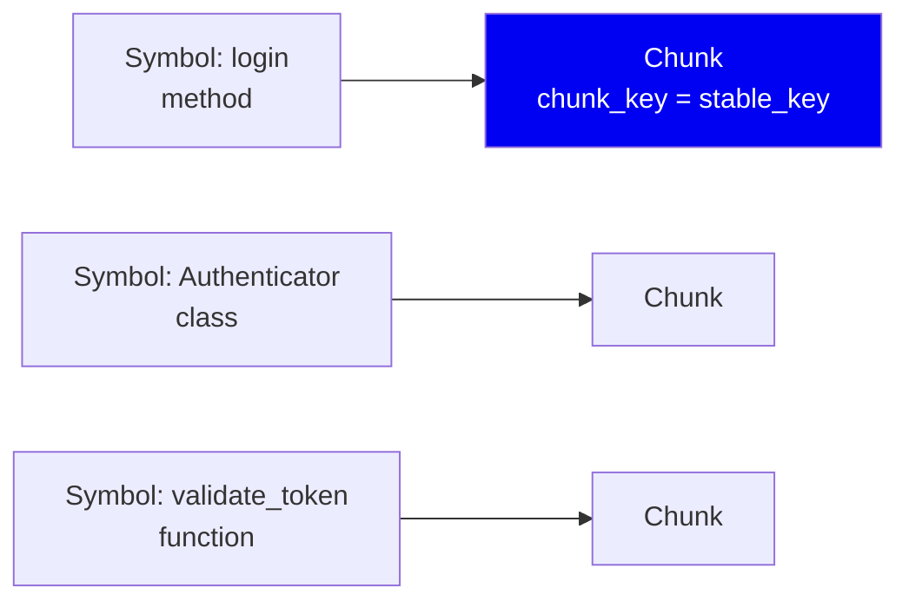
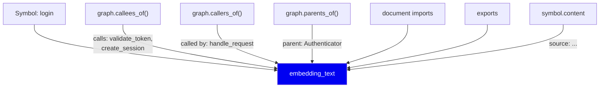
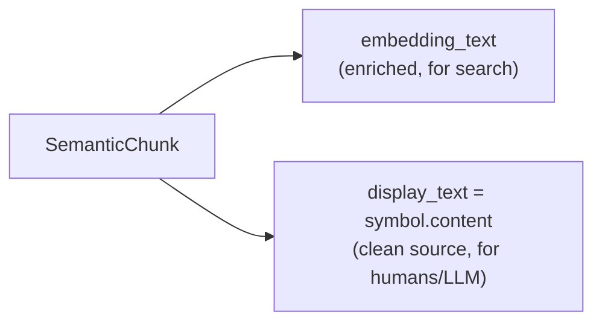
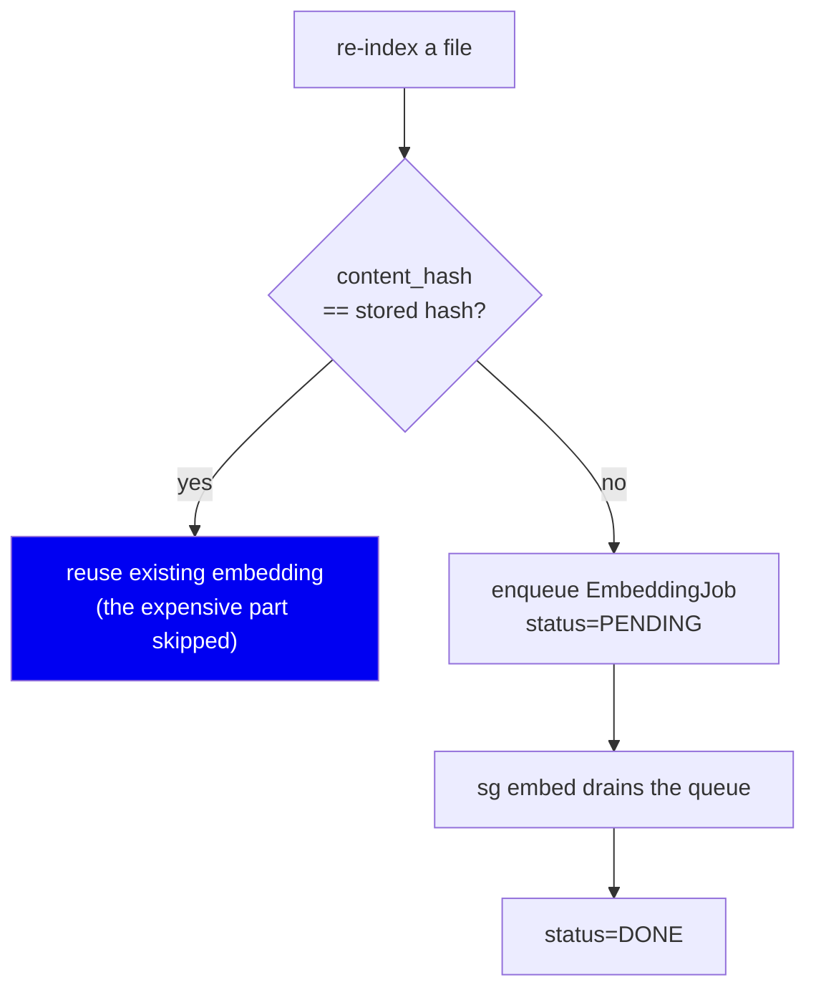
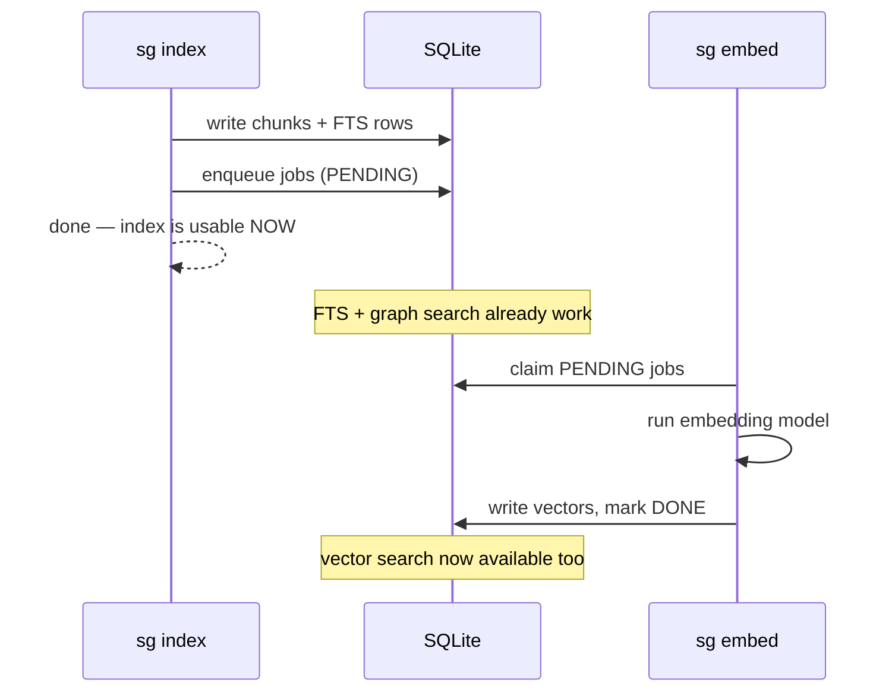

# 05 · Chunking & Embedding

**Phase 6 of the write path.** Turning symbols into searchable units.

> The single most counter-intuitive design decision in the codebase lives here:
> **what we embed is not the source code.**

---

## The problem

We have symbols and a graph. Now they must become searchable. Two sub-problems:

1. **What is a chunk?** ([01](01-why-symbol-graph.md) answered this: one symbol.)
2. **What text do we embed?** This one is not obvious at all.

---

## Chunk boundary — solved by construction

Because we already extracted symbols, the boundary question disappears:



**One symbol → one chunk.** `chunk_key` *is* the `stable_key`
(`chunking/symbol_chunker.py:129`), which means chunk identity inherits every
property from [03](03-symbols-and-identity.md): survives edits, survives
reformatting, distinguishes "changed" from "new".

No overlap windows, no split points, no tuning parameter. The language already
decided.

---

## The interesting decision — enriched embedding text

Here's the naive approach:

```python
embedding_text = symbol.content     # just the source
```

Here's what we actually build (`build_embedding_text`,
`chunking/symbol_chunker.py:180`):

```
method login
qualified name: Authenticator.login
file: auth.py
parent: Authenticator
calls: validate_token, create_session
called by: handle_request
imports: from auth import Authenticator, from utils import log
exports: login
source:
def login(self, user, token):
    if validate_token(token):
        return create_session(user)
    return None
```

The source is the **last** field. Everything above it is graph context.



### Why? Because of what a developer's question actually looks like

A developer asks: *"how does authentication work?"*

The word **"authentication"** may appear nowhere in `login`'s source. The
function body says `validate_token`, `create_session`, `return None`. Embedding
raw source means the query and the chunk have almost no lexical or semantic
overlap — the right answer scores badly.

But `login`'s *neighbourhood* is full of the signal: it lives in a class called
`Authenticator`, in a file called `auth.py`, and it calls `validate_token`.

**By embedding the neighbourhood, we make the chunk findable by what it *means
in context*, not just what it literally says.**

This benefits both retrieval channels:

| Channel | Benefit |
|---|---|
| **Full-text (FTS5)** | `Authenticator`, `auth.py`, `validate_token` are now literal, matchable tokens |
| **Vector** | The embedding sits near "authentication" in vector space because its context is about auth |

### The display/embedding split



Two fields, deliberately. We **search** the enriched text but **show** the raw
source. An agent receiving `parent: Authenticator\ncalls: ...` as its context
would be reading our metadata instead of the code. Search-time representation
and answer-time representation are different problems.

**Tradeoff:** the enriched text is larger than the source, so embedding costs
more and the FTS index is bigger. Worth it — retrieval quality is the product.

**Second tradeoff, and it's real:** `embedding_text` depends on the graph. If
`handle_request` starts calling `login`, then `login`'s `called by:` line
changes, so its `content_hash` changes, so it needs re-embedding — *even though
`login`'s own source never changed*. Editing one file can invalidate chunks in
another. That's the price of context-aware embeddings, and it's why the
incremental logic in [07](07-incremental-indexing.md) has to be careful.

---

## Content hashing and embedding reuse

```python
content_hash = compute_content_hash(embedding_text)   # sha256
```

Note it hashes the **embedding text**, not the source — precisely so the
graph-dependency above is captured. If anything that affects search changed,
the hash changes and we re-embed. If nothing did, we skip.



Embedding is the slowest operation in the write path (a model forward pass per
chunk). Hash-based reuse is what makes re-indexing cheap.

---

## Why embedding is a queue, not inline

Chunks are written to SQLite immediately; embeddings are computed **later**, by
draining an `embedding_jobs` table.



**Why decouple?** So the index is **useful before it is complete**. After
`sg index`, full-text and graph search work immediately. Vector search arrives
when it arrives. Blocking a 400-file index on a model download would make first
use feel broken.

It also means **embeddings are optional**. No model installed? FTS + graph
scores `0.83` definition accuracy on the fixture. With vectors: `0.92`. The
tool degrades rather than fails.

---

## The fallback path

Files with no symbols (`.md`, `.html`, `.yaml`) still need to be findable. A
synthetic `MODULE` symbol is created so the chunk has a valid foreign key, and
the chunk holds the file's text (truncated to 2000 chars).

This is the messiest code in the file — `build_semantic_chunks` has nested
conditionals distinguishing fallback languages from strict ones. It's honest to
say so: this is the part of the chunker most in need of a cleanup.

---

## Alternatives considered

| Approach | Why not |
|---|---|
| **Fixed-size windows (512 tokens)** | Splits definitions arbitrarily — the whole argument of [01](01-why-symbol-graph.md) |
| **Whole file per chunk** | Retrieval returns 800 lines; that's the cost we're removing |
| **Embed raw source only** | Loses the context signal — "authentication" wouldn't match `login` |
| **Embed a doc-comment summary** | Requires docstrings to exist and be accurate. Most code has neither |
| **LLM-generated summary per chunk** | Best quality, but needs an LLM call per symbol at index time. Slow, expensive, non-deterministic, and requires network — violates local-first |

That last one deserves a note: it is genuinely the highest-quality option, and
if this were a cloud product it might be the right call. It's incompatible with
"index a repo offline in one second".

---

## Summary

| Decision | Why | Cost |
|---|---|---|
| One chunk = one symbol | The language defines the boundary | Needs full extraction first |
| `chunk_key = stable_key` | Inherits stable identity | — |
| Embed graph-enriched text | Query words often live in the neighbourhood, not the body | Larger index; cross-file invalidation |
| Separate `display_text` | Search representation ≠ answer representation | Two fields stored |
| Hash the embedding text | Captures graph-dependent changes | Some re-embeds look "unnecessary" |
| Embed asynchronously | Index usable immediately; model optional | Vector search briefly unavailable |

**Next:** [06 · Storage](06-storage.md)
