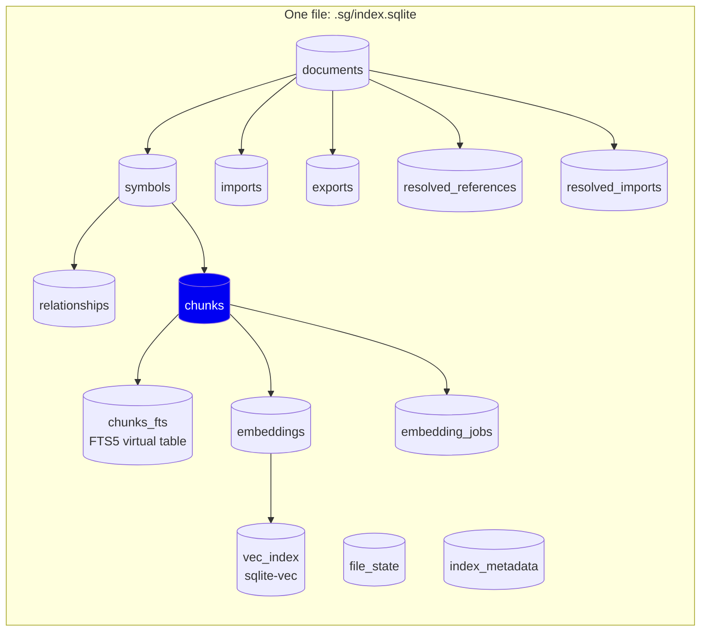
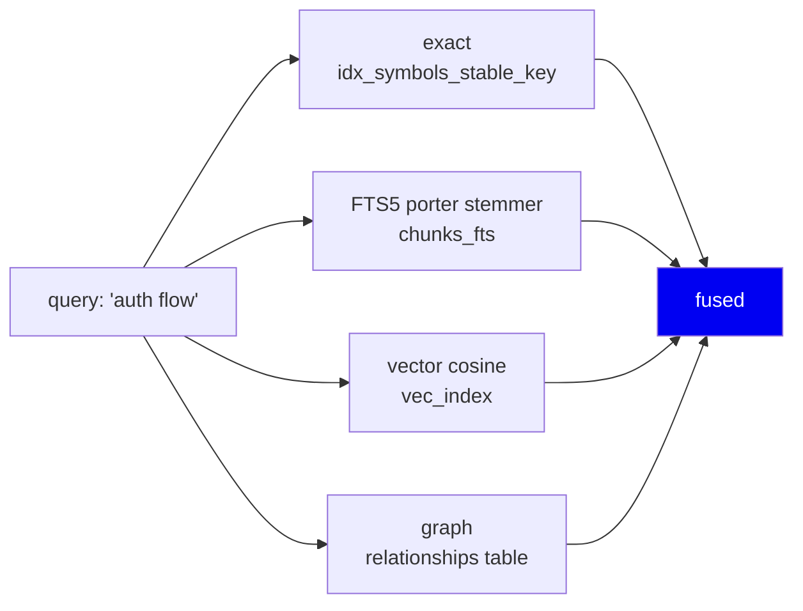
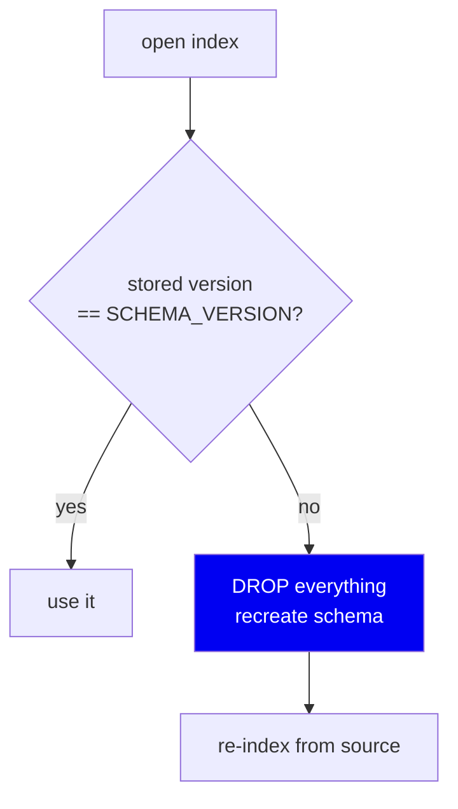

# 06 · Storage

**Phase 7 of the write path.** One file on disk that holds a graph, a full-text
index, and a vector index at once.

---

## The problem

We now have symbols, edges, and chunks. They must persist somewhere that:

- survives process exit (re-indexing on every CLI invocation is unacceptable),
- supports three *different* query shapes — exact lookup, full-text search,
  vector similarity,
- needs **zero setup** from the user,
- lives inside the user's repo and never phones home.

---

## The decision: one SQLite file

```
.sg/index.sqlite
```

That's it. Everything is in there.



13 tables plus an FTS5 virtual table and a `sqlite-vec` vector index. Schema in
`storage/schema.py`, currently `SCHEMA_VERSION = 6`.

### Why SQLite and not…

| Option | Why not |
|---|---|
| **Postgres + pgvector** | Best-in-class vector search — but it's a server. Install, port, credentials, migrations. Fatal for "works on a repo you just cloned" |
| **Neo4j** | The data *is* a graph. Also a server, also a daemon. Our traversals are 1–2 hops; we don't need a graph engine |
| **Elasticsearch** | Excellent full-text. A JVM server |
| **Pinecone / cloud vector DB** | Sends your source code to a third party. Directly violates local-first |
| **Plain JSON files** | No indexes. Every query becomes a full scan |
| **LanceDB / Chroma** | Genuinely good local options, but they solve *vectors*. We'd still need something for the graph and FTS — so now two stores to keep consistent |

**SQLite wins on one decisive property: it is a library, not a server.** It
ships with Python. There is no install step, no port, no daemon, no
credentials. And it does all three jobs adequately:

- **Relational/graph** — ordinary tables and indexes
- **Full-text** — FTS5, built in
- **Vector** — `sqlite-vec` extension, with a numpy fallback if it won't load

One store, one file, one consistency domain. Delete `.sg/` and it's gone.

**Tradeoff:** SQLite has a single writer. Concurrent `sg index` runs must
serialise (see the lock below). For a per-developer local tool that's fine; for
a shared multi-tenant service it would not be.

---

## Three indexes, three query shapes

The reason one store can serve retrieval is that each channel has its own
index:



**FTS5 with the `porter` stemmer** means "authenticating" matches
"authentication". Word-level stemming is exactly right for identifier-adjacent
search.

**`sqlite-vec` with a numpy fallback** (`storage/db.py:21`,
`load_vec_extension`): some Python builds refuse loadable extensions. Rather
than crash, we fall back to an in-memory numpy store. Slower on large repos,
but the feature still works. The pattern — *try the fast path, degrade
explicitly, never fail* — repeats throughout this codebase.

---

## PRAGMAs, and why each one is there

From `storage/db.py:8`:

```python
conn = sqlite3.connect(db_path, timeout=10, isolation_level=None)
conn.execute("PRAGMA journal_mode=WAL")
conn.execute("PRAGMA synchronous=NORMAL")
conn.execute("PRAGMA foreign_keys=ON")
conn.execute("PRAGMA temp_store=MEMORY")
conn.execute("PRAGMA cache_size=-64000")
conn.execute("PRAGMA busy_timeout=5000")
```

| PRAGMA | Why |
|---|---|
| `journal_mode=WAL` | Readers don't block the writer. A `sg search` during `sg index` still works |
| `synchronous=NORMAL` | Skips an fsync per commit. **Safe here because the index is derived data** — worst case after a crash you re-index |
| `foreign_keys=ON` | Off by default in SQLite. A chunk pointing at a deleted symbol is a real bug we want to fail loudly |
| `temp_store=MEMORY` | Sorts/joins in RAM, not temp files |
| `cache_size=-64000` | 64MB page cache |
| `busy_timeout=5000` | Wait rather than instantly erroring on a locked DB |

`synchronous=NORMAL` is worth dwelling on. On a database of record it would be
questionable — you can lose the last transaction on power loss. Here, **the
source code is the record and the index is disposable.** That single fact makes
a whole class of durability tradeoffs safe, and it recurs in the migration
strategy below.

---

## Migration strategy: drop and rebuild

Most systems write careful `ALTER TABLE` migrations. We don't:



**Why this is safe and not lazy:** the index contains *zero* original
information. Every row is derived from source files that are still sitting
right there. Rebuilding is strictly correct, whereas a hand-written migration
can be subtly wrong and corrupt derived state in ways nobody notices for weeks.

The cost is a full re-index on version bump — seconds to a minute. The benefit
is that we never write a migration, and can never write a *buggy* one.

**When would this be wrong?** If the index ever held something not
reconstructible from source. Session memory is deliberately in a *separate*
database (`.sg/session.sqlite`) for exactly that reason — decisions a developer
recorded are **not** derived data and must not be dropped on a schema bump.

---

## Concurrency and locks

Two `sg index` runs on the same repo would corrupt each other.
`indexing/resource_governor.py:61` provides `ProjectIndexLock` — an advisory
`fcntl.flock` on `.sg/.index.lock`.

**It is explicitly a no-op on Windows**, where `fcntl` doesn't exist. That is a
documented limitation, and it caused a real bug worth remembering:

> `.sg/` used to be created only as a *side effect* of the lock writing its
> lockfile. On Windows the lock is a no-op, so the directory was never created,
> and SQLite failed with *"unable to open database file"*. The fix was to make
> `reindex_index` create its own directory — **a component should not depend on
> another component's side effect for correctness.**

There is a second, related trap this codebase hit twice:

```python
with sqlite3.connect(path) as conn:    # ⚠ does NOT close the connection
    ...
```

Python's sqlite3 context manager commits or rolls back the **transaction**. It
never closes the handle. On Linux that's an invisible leak; on Windows an open
handle blocks deleting the file. Every connection site now either uses
`contextlib.closing` or a context manager that closes in `finally`.

---

## Storage layout on disk

```
your-repo/
├── .sg/
│   ├── index.sqlite       ← derived, disposable, gitignored
│   ├── session.sqlite     ← NOT derived; separate lifecycle
│   └── .index.lock
└── src/...                ← never modified
```

The separation is deliberate. `rm -rf .sg/` is a safe, documented reset.

---

## Summary

| Decision | Why | Cost |
|---|---|---|
| One SQLite file | Library not server; zero setup | Single writer |
| FTS5 + sqlite-vec + tables | Three query shapes, one consistency domain | Larger schema |
| numpy fallback for vectors | Some builds block extensions | Slower fallback path |
| `synchronous=NORMAL` | Index is derived; crash = re-index | Can lose last txn |
| `foreign_keys=ON` | Dangling references are real bugs | Stricter writes |
| Drop-and-rebuild migrations | Derived data; a migration can be buggy, a rebuild can't | Full re-index on bump |
| Session memory in a separate DB | It is *not* derived and must survive | Two files |

**Next:** [07 · Incremental indexing](07-incremental-indexing.md)
