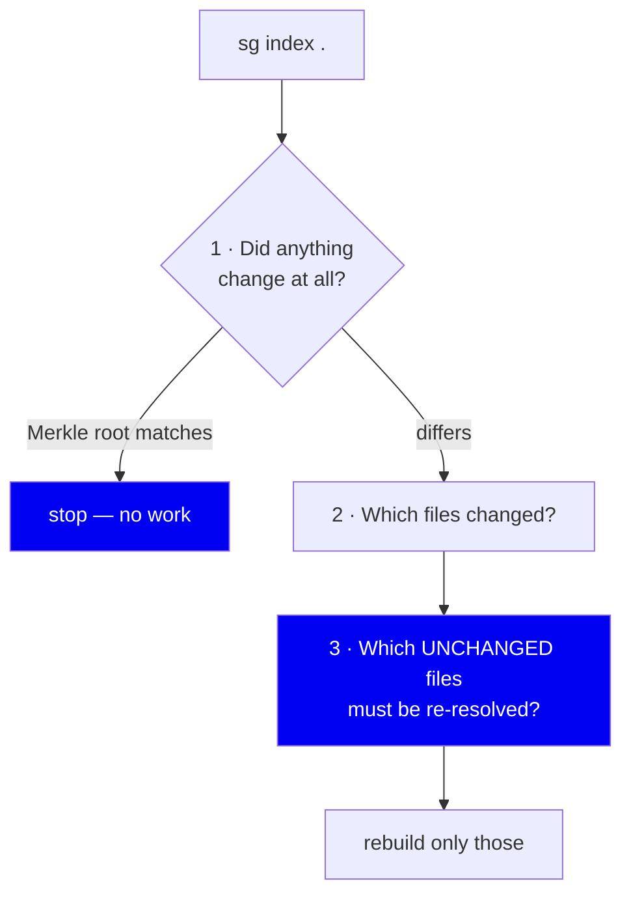
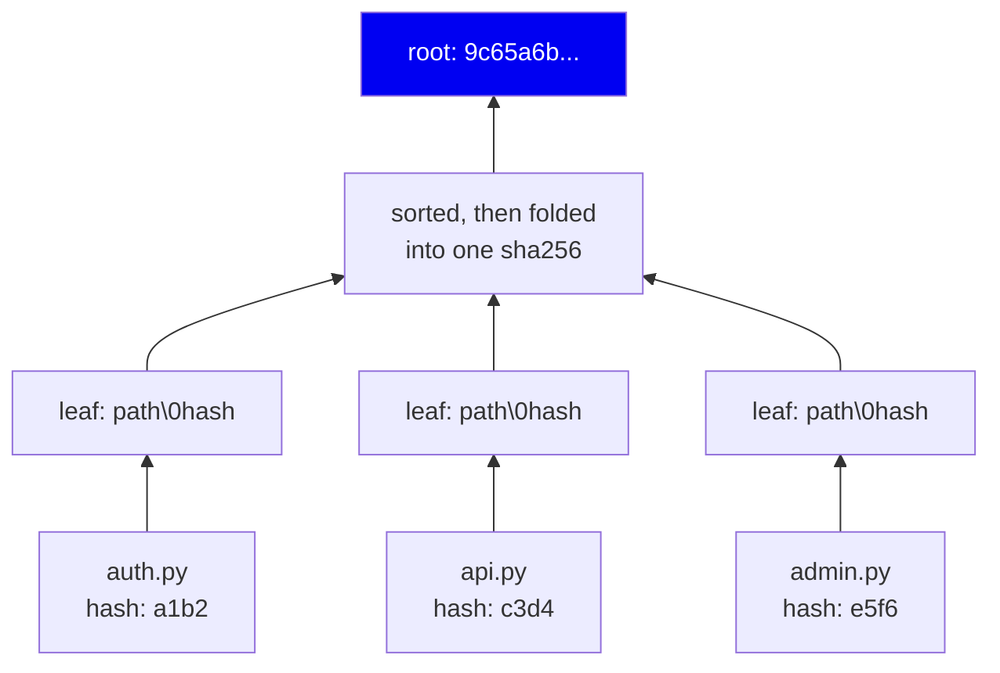
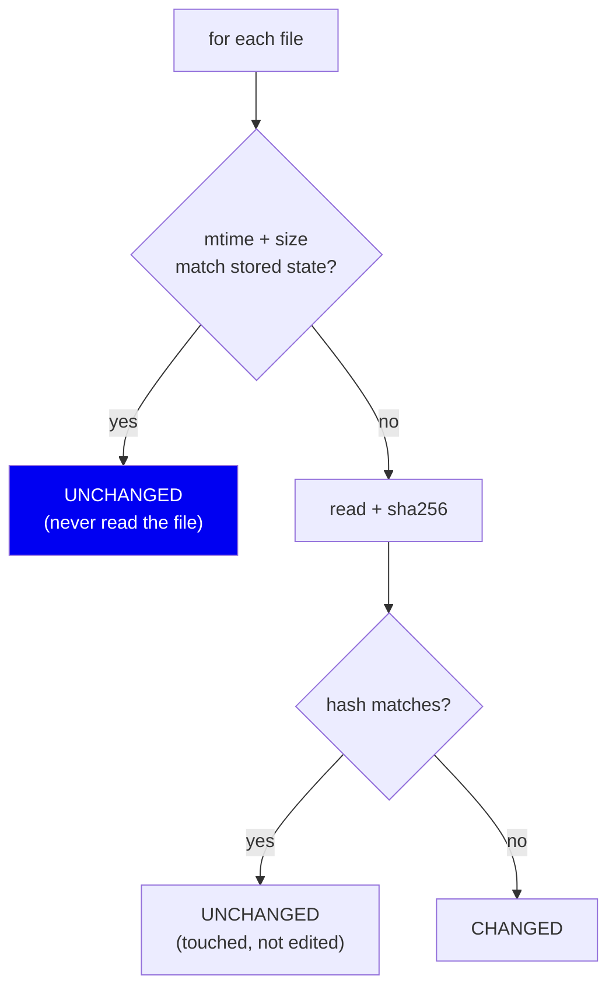
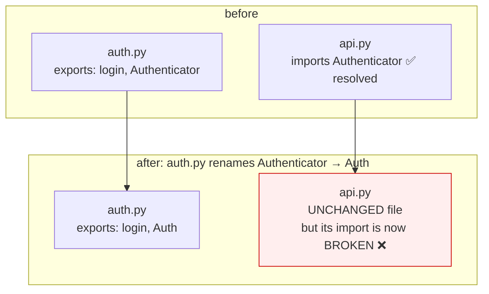
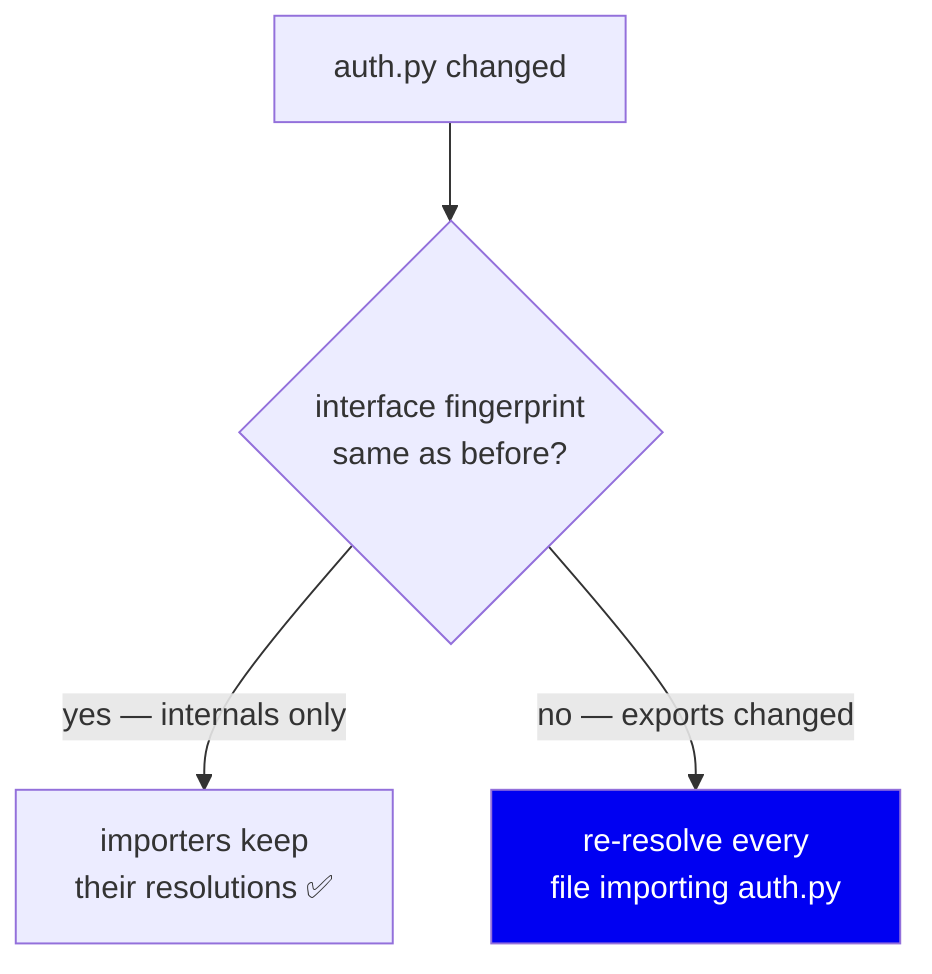
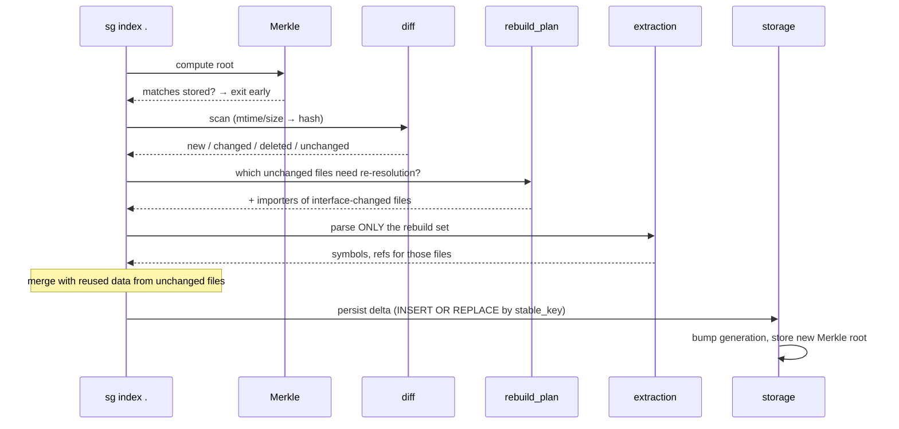

# 07 · Incremental Indexing

**Phase 8 of the write path.** Doing as little work as possible on the second
run.

---

## The problem

You edit one file and save. If re-indexing costs what the first index cost,
nobody keeps the index fresh, and a stale index is worse than none — it
confidently returns deleted code.

Measured on this repository:

```
$ sg index .          # first run
  parsed files:        349

$ sg index .          # nothing changed
  parsed files:        0
  unchanged:           350
0.26 s
```

**Zero files re-parsed. A quarter of a second.** That is the entire goal of
this phase.

---

## Three questions on every run



Question 3 is the subtle one, and the reason this phase needs its own document.

---

## Question 1 — the Merkle root

`indexing/merkle.py` computes one hash for the whole repository:



Leaves are sorted before folding, so the root is **deterministic** — same files
in any filesystem order produce the same root. Directory hashes are also folded
in, which gives hierarchical visibility into *which subtree* moved.

One string comparison answers "is there any work to do at all?".

**Why not just compare file hashes directly?** We do, at step 2. The Merkle
root is the cheap *early exit* — one comparison instead of walking a dict of
thousands of entries. On the common case (nothing changed) it's the fastest
possible answer.

---

## Question 2 — which files changed

`indexing/diff.py`, `scan_files()`. Two-tier check:



**mtime + size is a hint; the hash is the truth.**

- If mtime and size both match, we skip reading the file entirely. This is the
  fast path and it's why an unchanged 400-file repo takes 0.26s — we barely
  touch the disk.
- If they differ, we read and hash. `git checkout` rewrites mtimes on files
  whose content is identical; hashing catches that and reports UNCHANGED,
  avoiding a pointless rebuild.

Using mtime *alone* would be faster but wrong (mtime lies in both directions).
Hashing *everything* would be correct but slow. The two-tier check is the
standard resolution, and it's what `make`, `git` and every build system do.

---

## Question 3 — the subtle one: cross-file invalidation

Here is the trap. You change `auth.py`. Only `auth.py` needs re-parsing — but
is it the only file that needs re-**resolving**?



`api.py` didn't change. Its bytes are identical. But its *resolution* is now
wrong. If we only rebuild changed files, `api.py` keeps a stale edge pointing
at a symbol that no longer exists.

### The solution: interface fingerprints

`indexing/diff.py:127`, `interface_fingerprint()` computes a signature of a
file's **public exported interface** — for each export, `(exported_name,
signature_hash)`.



This is the key distinction:

| Change to `auth.py` | Interface fingerprint | Importers re-resolved? |
|---|---|---|
| Reformat a function body | unchanged | **No** |
| Add a private helper | unchanged | **No** |
| Rename an exported symbol | **changed** | **Yes** |
| Add a new export | **changed** | **Yes** |
| Delete the file | n/a | **Yes** |
| Add a brand-new file | n/a | **Yes** — it may satisfy imports that previously had no target |

That last row is easy to miss. A *new* file can fix a previously-unresolvable
import, so additions must also trigger re-resolution. `indexing/rebuild_plan.py`
documents all three cases in its module docstring.

**This is the same idea as a build system's header dependencies.** Changing a
`.c` file rebuilds one object; changing a `.h` file rebuilds everything that
includes it. The interface fingerprint is our header.

---

## Putting it together



The merge step is why `analysis/pipeline.py` splits extraction from resolution
into two callable phases — the incremental path needs to inject reused data
between them.

---

## Why `stable_key` makes this possible

Persistence is `INSERT OR REPLACE` keyed on `stable_key`. That works *only*
because identity is stable ([03](03-symbols-and-identity.md)):


If identity included line numbers, every edit would delete and re-insert every
symbol below it, and every edge would need rebuilding. **The incremental design
is only possible because of the identity design.** They are one decision, made
in two places.

---

## Keeping it fresh automatically

Two mechanisms, both optional:

| Mechanism | How | Tradeoff |
|---|---|---|
| **Git hooks** (`indexing/git_hooks.py`) | `post-commit`/`post-checkout`/`post-merge` run `nice -n10 sg index &` | Only fires on git operations |
| **File watcher** (`indexing/watcher.py`) | `watchdog` with a 0.5s debounce | A running process |

The hook uses `nice -n10` and backgrounds itself so committing never blocks.
It also guards with a lockfile carrying a PID, so a stale lock from a killed
process doesn't wedge indexing forever.

The watcher debounces because editors emit **many** events for one save
(write temp, rename, chmod). Reindexing per event would be constant churn.

---

## What this costs

| Cost | Detail |
|---|---|
| Complexity | Three questions, a rebuild plan, and a merge step. Substantially more code than "just re-index" |
| Cross-file invalidation risk | If interface fingerprinting is wrong, you get a *stale* index — worse than a slow one |
| Graph-dependent chunks | Per [05](05-chunking-and-embedding.md), one file's edit can invalidate another's chunk |

The mitigation for the middle row is a specific test:
`tests/test_incremental_indexer.py::test_incremental_matches_full_rebuild`
indexes incrementally, then indexes the same content from scratch in a separate
directory, and asserts **the two databases are identical table by table**
(masking UUIDs, timestamps and paths).

That test is the safety net for this entire phase. Any bug where incremental
diverges from a full rebuild shows up as a diff.

---

## Summary

| Decision | Why | Cost |
|---|---|---|
| Merkle root | One-comparison early exit | Must recompute on change |
| mtime+size, then hash | Fast path + correctness | Two-tier logic |
| Interface fingerprints | An unchanged file's *resolution* can still break | Real complexity |
| New files trigger re-resolution | They may satisfy previously-broken imports | Wider rebuild set |
| `INSERT OR REPLACE` on `stable_key` | Edits update in place; edges survive | Needs stable identity |
| Equivalence test vs full rebuild | Stale-index bugs are the dangerous ones | A slow test |

**Next:** [08 · Retrieval](08-retrieval.md)
