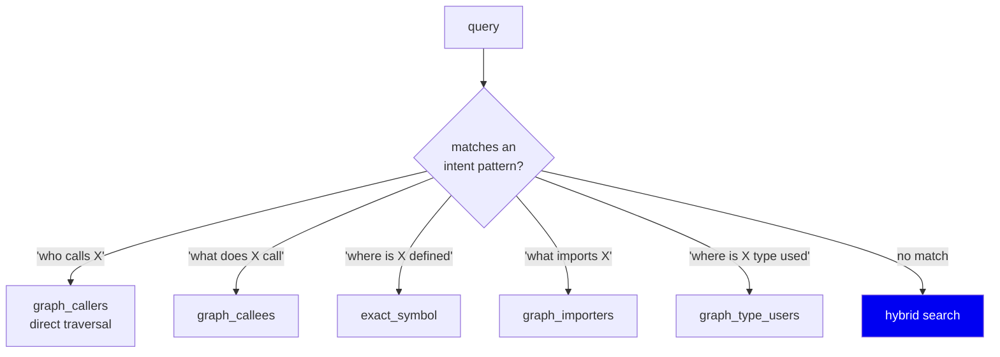
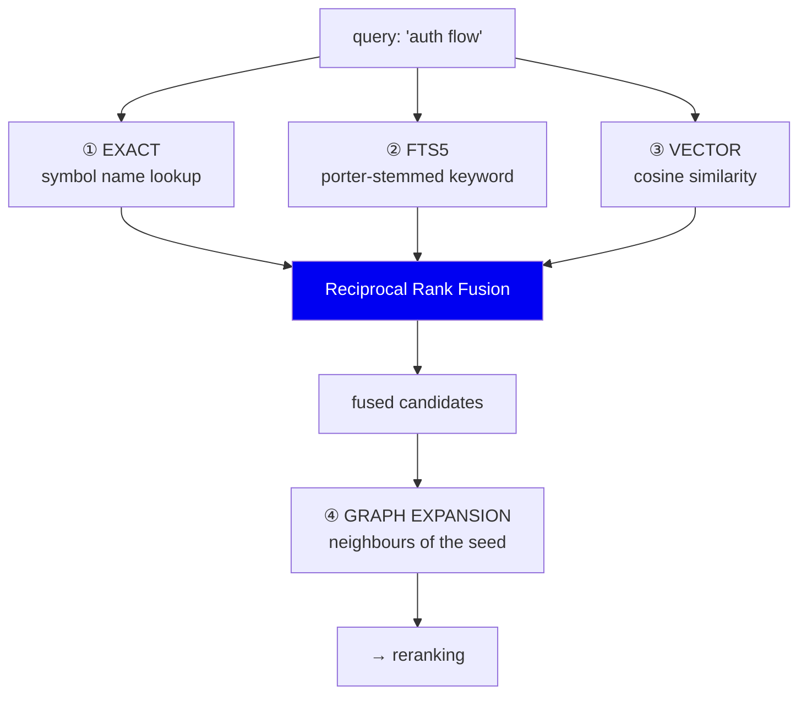
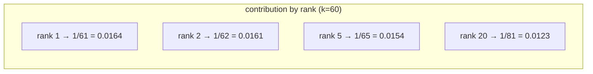
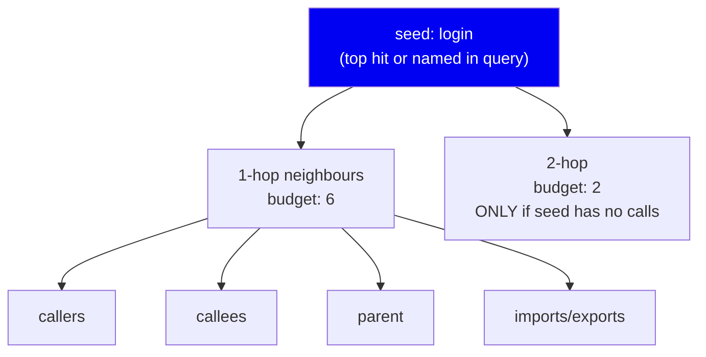
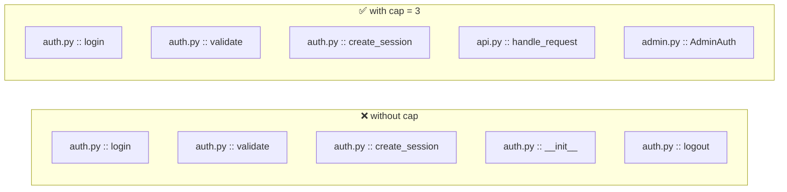
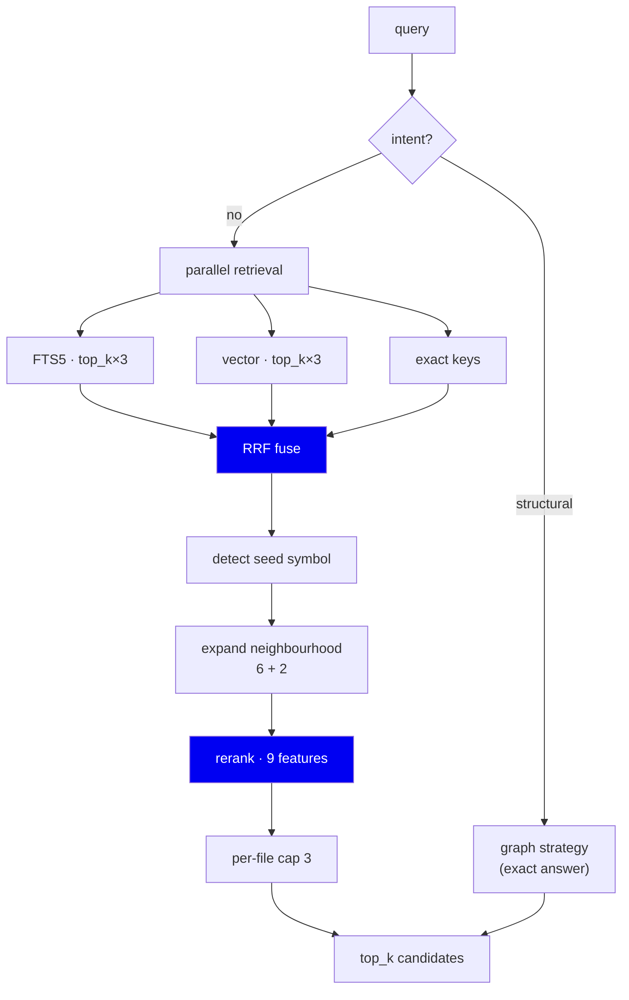

# 08 · Retrieval

**Phase 9 — the read path begins.** Turning a question into candidate symbols.

---

## The problem

A developer's question can be any of these:

| Question | What it actually wants |
|---|---|
| "where is `validate_token` defined" | One exact symbol |
| "who calls `login`" | A graph traversal |
| "how does authentication work" | Fuzzy, conceptual — many symbols |
| "auth flow" | Keywords, no structure |

**No single retrieval method handles all four.** Exact lookup fails on the
conceptual question. Vector search is wasteful and imprecise for an exact name.
Graph traversal needs a starting point.

So the design question isn't "which retrieval method" — it's **"how do we
combine several without one drowning out the others?"**

---

## Step 1: Is this a structural question?

Before any search, check whether the query has an unambiguous structural
answer (`detect_intent`, `retrieval/hybrid_retriever.py:99`):



**Why bother?** Because "who calls `login`" has a *correct* answer that the
graph already knows. Running a similarity search for it would be strictly
worse: slower, and it might rank a lexically-similar-but-wrong function above
the actual caller. When you have ground truth, use it.

The pattern order matters and is commented in the source: callers/callees/
definition are unambiguous, so they match first. Importer phrasing ("what
**uses** X") overlaps with ordinary English, so it runs last to avoid
hijacking conceptual queries.

**Tradeoff:** regex intent detection is brittle. "who invokes login" won't
match. The mitigation is that a miss falls through to hybrid search, which
still returns something reasonable — a graceful degradation, not a failure.

---

## Step 2: Hybrid search — four channels

For everything else, we run four independent retrievers:



| Channel | Strength | Blind spot |
|---|---|---|
| **Exact** | Perfect for a known name | Useless for concepts |
| **FTS5** | Fast, catches identifiers and comments | No synonyms |
| **Vector** | Understands "auth" ≈ "authentication" | Weak on exact names; needs a model |
| **Graph** | Finds *related* code no text search would | Needs a seed |

Note that graph expansion runs **after** fusion, not as a fourth fused list —
it needs a seed symbol, which the first three provide.

---

## Reciprocal Rank Fusion — the core of the design

Three rankers return three lists. How do you merge them?

### The naive approach and why it fails

Normalise each score to 0–1 and add them.

**This does not work**, because the scores aren't comparable:

- FTS5 returns BM25-ish relevance — unbounded, corpus-dependent
- Vector search returns cosine similarity — always 0–1, and typically bunched
  in a narrow band like 0.7–0.9
- Exact match is boolean

Normalising them puts them on the same *numeric* scale without putting them on
the same *meaning* scale. A cosine of 0.85 might be a poor match while an FTS
score of 4.0 is excellent. Adding them lets whichever channel has the widest
numeric range dominate — usually by accident.

### RRF: throw away the scores, keep the ranks

```python
# retrieval/ranking.py
RRF_K = 60

for ranked_list in ranked_lists:
    for rank, key in enumerate(ranked_list):
        scores[key] += 1.0 / (k + rank + 1)
```

**Only position matters.** Being 1st in the FTS list contributes exactly as
much as being 1st in the vector list, regardless of the underlying numbers.



Two properties fall out:

1. **Scale-free.** No normalisation, no tuning per channel. Add a fifth
   retriever tomorrow and nothing needs recalibrating.
2. **Consensus beats brilliance.** A result ranked 3rd by *all three* channels
   (0.0159 × 3 ≈ 0.048) beats one ranked 1st by a single channel (0.0164).
   That's the behaviour we want — agreement across independent signals is
   stronger evidence than one confident channel.

### Why k = 60?

`k` flattens the curve. With `k=60`, rank 1 and rank 2 differ by only 2%, so
RRF says *"this channel put it near the top"* rather than *"this channel put it
exactly first"* — appropriate, since a ranker's exact ordering at the top is
noisy.

60 is the value from the original RRF paper (Cormack et al., 2009) and is the
widely-used default. **We did not tune it**, and it's worth being explicit
about that: it's a reasonable default we adopted, not an optimised parameter.

### Alternatives

| Approach | Why not |
|---|---|
| Weighted score sum | Requires per-channel normalisation + weight tuning, both corpus-dependent |
| Learning-to-rank on fused scores | Needs labelled training data at a scale we don't have (see [12](12-evaluation.md)) |
| Pick one channel by query type | That's the intent detection above — good when confident, but most queries are ambiguous |
| **RRF** ✅ | No tuning, scale-free, robust. The standard answer for exactly this problem |

---

## Step 3: Graph expansion

Fusion gives ranked symbols. Now use the graph — this is the part pure-text
systems can't do.



From `retrieval/neighborhood.py`:

- **One-hop budget: 6.** Ordered by relation type — callers, callees, parent,
  import, export.
- **Two-hop budget: 2**, and only entered when the seed has *no* callers and
  *no* callees. A class often has neither (its *methods* do the calling), so
  this reaches through children to their callees. Without it, searching for a
  class name returns the class and nothing useful.

**Why budgets at all?** Because a popular utility function has 200 callers.
Without a cap, one seed floods the entire result set and the token budget is
gone before any other match is included. The budgets are the difference between
"related context" and "the whole call graph".

---

## Step 4: Per-file diversity cap

The final selection allows **at most 3 chunks per file** (`DEFAULT_PER_FILE_CAP`).



If a file is highly relevant, *all* its symbols score well, and results collapse
into a single file — which is exactly the whole-file context we're trying to
avoid.

The comment at `retrieval/hybrid_retriever.py:60` records that this was
measured, not guessed: without the cap, distinct-file coverage on the FastAPI
benchmark collapsed; with `cap=3` it recovered to 10 distinct files.

---

## Full flow



Each channel fetches `top_k × 3` before fusion — a deeper pool means fusion has
room to promote consensus results that no single channel ranked first.

---

## Summary

| Decision | Why | Cost |
|---|---|---|
| Intent detection first | Structural questions have exact answers | Brittle regexes; falls through on a miss |
| Four channels | Every single method has a blind spot | More code, more index |
| RRF over score-sum | Scores across rankers aren't comparable | Discards score magnitude |
| `k=60` | Paper default; flattens noisy top ranks | Untuned |
| Expansion budgets 6+2 | A popular symbol would flood results | May miss a relevant 7th neighbour |
| Per-file cap 3 | Prevents one-file collapse | May exclude a 4th relevant symbol |
| Fetch `top_k×3` per channel | Gives fusion room to find consensus | Slightly more work |

**Next:** [09 · Reranking](09-reranking.md)
