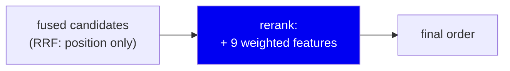
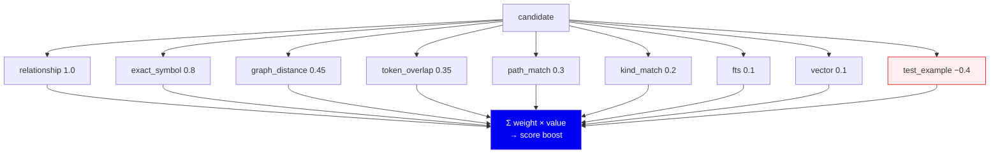
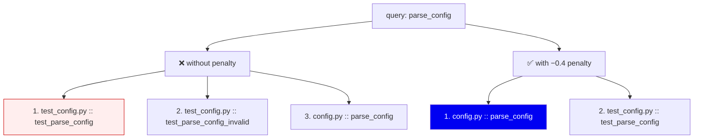
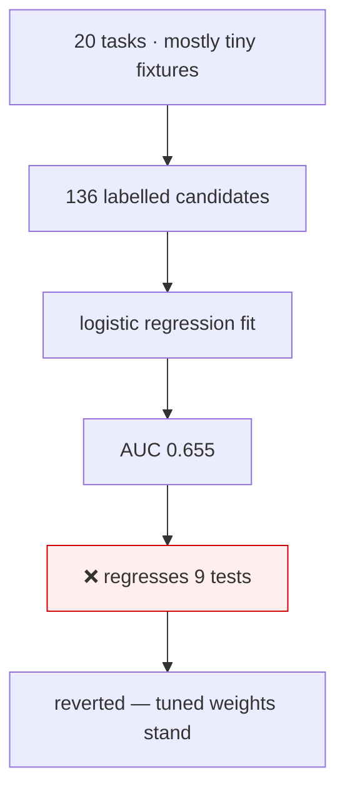

# 09 · Reranking

**Phase 10.** Fusion says *what* is relevant. Reranking decides *what comes
first*.

---

## Why rerank at all?

RRF is deliberately blunt — it only knows rank positions. It has no idea that:

- the user typed the symbol's **exact name**,
- one candidate is a **test file** and the other is the implementation,
- one is a **direct caller** of the symbol the query named,
- the query asked "who calls X" so **callers** should outrank X itself.

These are cheap, high-signal facts available *after* fusion. Reranking is where
they get applied.



The mechanism is deliberately simple — a **linear score boost**:

```python
candidate.score += sum(weight * feature_value for ...)
```

Then re-sort. That's the whole algorithm.

---

## The nine features

From `retrieval/reranker.py`, with the current shipped weights
(`retrieval/learned_weights.json`):

| # | Feature | Weight | What it captures |
|---|---|---|---|
| 1 | `relationship` | **1.0** | Candidate is a caller/callee/parent of the seed |
| 2 | `exact_symbol` | **0.8** | The candidate's name appears literally in the query |
| 3 | `graph_distance` | **0.45** | How many hops from the seed |
| 4 | `token_overlap` | **0.35** | Query words vs. identifier words |
| 5 | `path_match` | **0.3** | Query words vs. the file path |
| 6 | `kind_match` | **0.2** | Query says "class"/"function" and kind agrees |
| 7 | `fts` | **0.1** | Full-text rank |
| 8 | `vector` | **0.1** | Vector rank |
| 9 | `test_example` | **−0.4** | Candidate is in a test/example file |



### Why `relationship` is the heaviest

Because it's the feature no text-based system has. If you asked about `login`
and a candidate *calls* `login`, that is strong evidence — stronger than any
lexical overlap. This weight is where the graph earns its place.

### Why `test_example` is negative

This is the most interesting feature, and it came from a real observed failure.

Search for `parse_config`. The test file `test_config.py` contains that name
many times — in the test name, in assertions, in comments. By pure text
relevance it **outranks the actual implementation**.



**Crucially it's a penalty, not a filter.** Tests are legitimately what you want
sometimes ("how is this tested?", "show me an example"). Excluding them would be
wrong. Demoting them makes the implementation win by default while keeping tests
reachable.

Patterns matched (`_TEST_EXAMPLE_PATTERNS`): `tests?/`, `test_*`, `*_test.*`,
`_examples?/`, `testdata/`.

---

## Two refinements worth understanding

### IDF weighting on path matches

Naive path matching over-rewards common directory names. In a repo where every
file is under `src/`, matching "src" means nothing.

`_idf_weight()` applies inverse document frequency to **basename tokens**:

```
weight = 1 - log(1 + df) / log(1 + total)
```

- A token in 1 of 900 files → weight ≈ 0.9 (**rare, informative**)
- A token in all 900 files → weight = 0 (**ubiquitous, worthless**)

So matching `converters` in `converters.py` scores highly; matching `src`
scores nothing. This is the same intuition as TF-IDF, applied to paths.

### Damping over-common kinds

If a query says "class" and 80 of 90 candidates are classes, that feature
carries no information. The kind feature is damped when a kind is shared by
more than half the candidate pool, using the smaller of a linear damp and the
IDF curve.

Both refinements share one principle: **a feature is only informative when it
discriminates.** A signal every candidate has is not a signal.

---

## Intent-aware preference

`detect_preference()` reads the query for caller/callee/definition phrasing and
passes it into the `relationship` feature, so "who calls login" boosts *callers*
specifically rather than all neighbours.

This overlaps with the intent detection in [08](08-retrieval.md) but works at a
different layer: intent detection may pick a whole different strategy;
preference tunes ranking *within* hybrid search when the phrasing was
suggestive but not decisive.

---

## The honest part: these weights are tuned, not learned

`learned_weights.json` is a slightly misleading filename, and the codebase says
so out loud. Its own metadata reads:

```json
"_method": "grid search relationship/exact vs heuristic"
```

**This is a hand-tuned heuristic validated by grid search on a fixture — not a
learned model.** The distinction matters: a learned reranker implies fitting on
labelled relevance data, and we haven't done that.

### We tried to do it properly, and it failed

`scripts/train_reranker_learned.py` is real, working infrastructure: it does a
genuine logistic-regression fit over `(query, candidate, features)` triples
captured from **live retriever runs** across all 20 evaluation tasks, labelled
against each task's expected files/symbols.

Result: **136 examples, training AUC 0.655 — and swapping its output in
regressed 9 previously-passing reranker tests.**



**The lesson, and it's a general one:** 20 tasks over small fixtures is too thin
a sample to beat a well-tuned heuristic. Shipping the "learned" weights would
have been worse *and* would have let us claim a more impressive-sounding
method. The script is committed so a future attempt starts from working
infrastructure rather than rediscovering this.

We also confirmed by experiment that the A/B agent-run data (`ab_runner.py`)
**cannot** supervise this model — it records whole-task outcomes (success,
tokens, tool calls), not per-candidate relevance. There is no valid path from
one to the other, at any sample size.

---

## Why linear, and not something better?

| Approach | Why not |
|---|---|
| **Cross-encoder** (BERT-style reranker) | Much better quality — and a model inference per candidate. Kills the local-first, sub-second promise |
| **Gradient-boosted trees (LambdaMART)** | The standard LTR answer, but needs labelled data we don't have |
| **LLM reranking** | Best quality, needs a network call per query, non-deterministic |
| **Linear weighted sum** ✅ | Microseconds, fully inspectable, debuggable by reading nine numbers |

The decisive property is **inspectability**. When a result ranks oddly you can
print nine feature values and see exactly why. With a cross-encoder you get a
number and a shrug. For a tool whose credibility rests on explaining itself,
that matters more than a few points of accuracy.

---

## Summary

| Decision | Why | Cost |
|---|---|---|
| Rerank after fusion | RRF only knows positions | An extra pass |
| Linear weighted sum | Fast, inspectable, debuggable | Can't model feature interactions |
| `relationship` weighted highest | The signal no text system has | Depends on seed detection |
| Test files penalised, not filtered | Tests are sometimes the answer | Wrong when you *want* tests |
| IDF on path tokens | Common directories carry no information | Needs corpus statistics |
| Weights labelled "tuned", not "learned" | Because that's what they are | Sounds less impressive |
| Reverted the real logistic fit | It regressed 9 tests | Feature stays un-learned |

**Next:** [10 · Context packing](10-context-packing.md)
