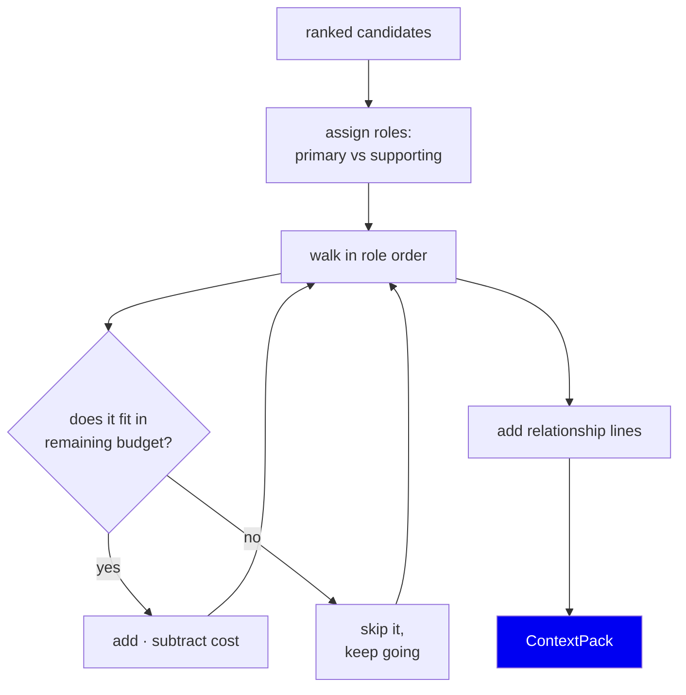
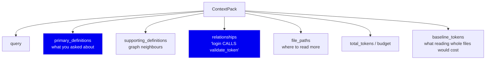
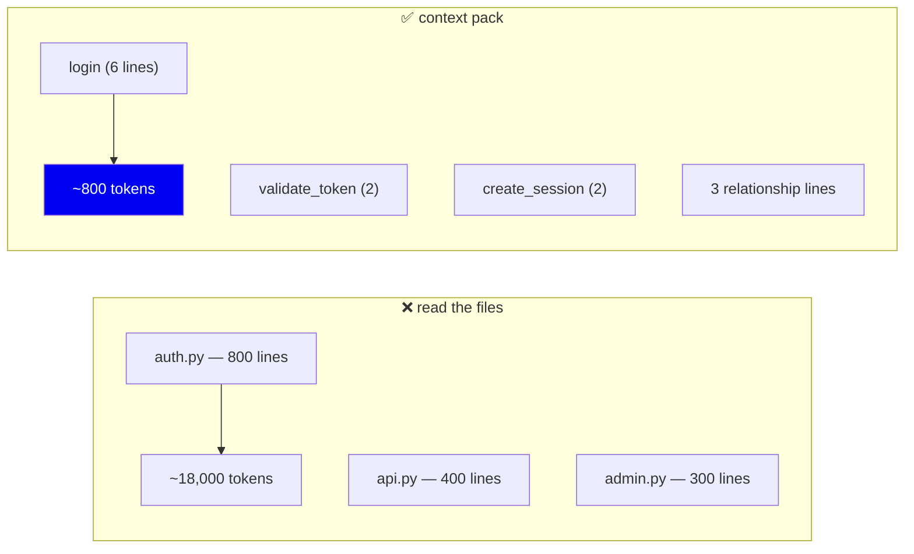
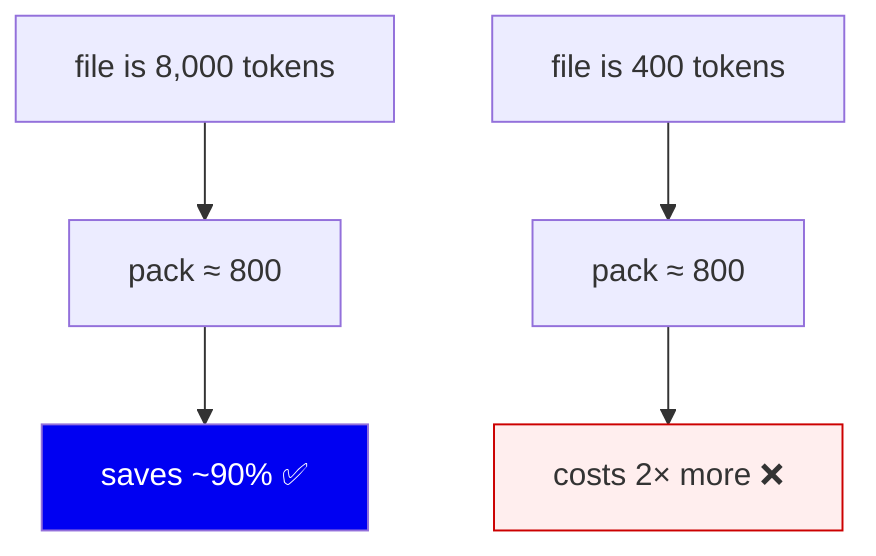

# 10 · Context Packing

**Phase 11.** Turning ranked symbols into an answer that fits a token budget.

---

## The problem

Retrieval returned 20 good candidates. The agent has a budget — say 800 tokens.
Twenty full definitions might be 8,000 tokens.

Something must be dropped. **The question is what, and how to drop it without
making the answer useless.**

This is where the token savings in [12](12-evaluation.md) are actually
realised. Everything before this phase found the right code; this phase is what
makes it cheap.

---

## Budget-aware assembly

From `retrieval/context_builder.py:40`, `build_context_pack()`.

Two details in that loop matter:

**Roles come before budget.** Candidates are split into `primary` (what the
query asked about) and `supporting` (graph neighbours that provide context),
and primaries are walked first. So a tight budget spends itself on the answer,
not on context around a partial answer.

**A too-large entry is skipped, not fatal.** The loop `continue`s. A 900-token
function in an 800-token budget doesn't abort the pack or truncate mid-line —
it's dropped, and the next (smaller, still relevant) candidate gets its chance.
You'd rather have three complete definitions than one severed one.

---

## What the pack contains

Two fields deserve attention:

### `relationships` — the cheap, high-value part

Lines like `handle_request CALLS Authenticator`. A relationship line costs a
handful of tokens but tells the agent something it would otherwise need a
whole extra file (and another round trip) to learn.

This is the best token-per-insight ratio in the entire pack. It exists only
because we built a graph — a chunk-based system has nothing to put here.

### `baseline_tokens` — measuring ourselves honestly

The pack records what reading the relevant files *whole* would have cost. That
number is what the savings claim is computed from, and storing it on the pack
means the claim is derived from a real measurement at query time, not estimated
afterwards. See [12](12-evaluation.md).

---

## Counting tokens properly

`retrieval/tokenizer.py` uses **tiktoken with `o200k_base`** — a real BPE
tokenizer — with a `len // 4` fallback.

**Why a real tokenizer?** Because `chars / 4` is a rough heuristic that's
particularly bad on code. Identifiers like `getUserAuthenticationToken` and
punctuation-dense lines tokenize very differently from prose. If the budget is
a lie, either we overflow the agent's context or we waste it.

**Why keep the fallback?** tiktoken downloads its encoding on first use. On an
offline machine that fails. Falling back to `chars/4` keeps retrieval *working*
with a slightly wrong budget, rather than failing outright. This is the same
degradation pattern as `sqlite-vec` → numpy and Ollama → FTS-only:

> **Try the accurate path, degrade explicitly, never fail.**

---

## Why definitions, not files

The comparison the whole project rests on:

Measured on Django: **8,909 → 811 tokens per query, at recall@10 = 1.00.**

The recall number is the important half of that sentence. Any system can save
tokens by returning less. Saving tokens *while still finding the right files*
is the actual claim, which is why we never publish a savings figure without its
recall.

---

## Where it stops paying: the fixed overhead

A pack has structure — headers, roles, relationship lines, file paths — costing
roughly 800 tokens regardless of content.

On a file smaller than the overhead, **packing is worse than just sending the
file.** Measured:

| Baseline file size | Django | Fiber | FastAPI |
|---|---|---|---|
| > 4k tokens | +93.9% | +90.4% | +94.4% |
| 1k–4k | +65.8% | +53.3% | +60.3% |
| < 1k | +11.3% | **−21.1%** | **−293.3%** |

We publish the negative rows. They're what make the positive ones believable —
and they tell you honestly when *not* to use this.

**Could we fix it?** Yes: detect that the baseline is below the overhead and
just return the file. That's a genuine, unimplemented improvement. It's listed
here rather than quietly omitted.

---

## Alternatives considered

| Approach | Why not |
|---|---|
| **Truncate to fit** | Half a function is worse than no function. The whole point is complete definitions |
| **Summarise with an LLM** | Network call per query, non-deterministic, slow. Kills local-first |
| **Return only file paths** | Cheap, but the agent then reads the files — the cost we're removing |
| **Fixed top-N, ignore budget** | Overflows context on large symbols, wastes it on small ones |
| **Budget-aware selection of whole definitions** ✅ | Complete units, predictable cost, deterministic |

---

## Summary

| Decision | Why | Cost |
|---|---|---|
| Primaries before supporting | Tight budgets should buy the answer first | Neighbours may be dropped |
| Skip oversized entries | Complete definitions beat truncated ones | A large relevant symbol can be excluded |
| Include relationship lines | Best insight-per-token in the pack | Small budget cost |
| Real BPE tokenizer | `chars/4` is unreliable on code | First-run download |
| `chars/4` fallback | Offline must still work | Slightly wrong budgets |
| Record `baseline_tokens` | Savings must be measured, not estimated | Extra field |
| Publish negative small-file rows | Honest scope of the claim | Less impressive headline |

**Next:** [11 · Serving over MCP](11-serving-mcp.md)
