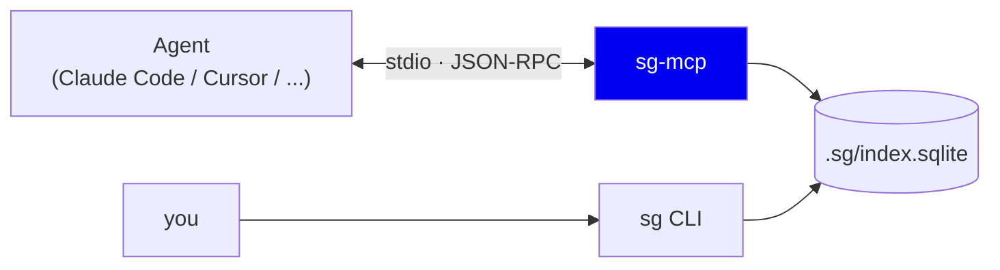
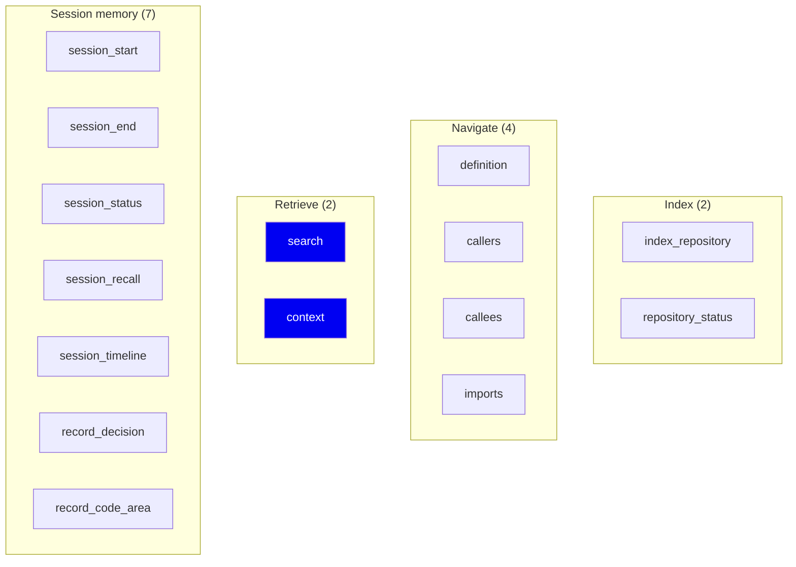
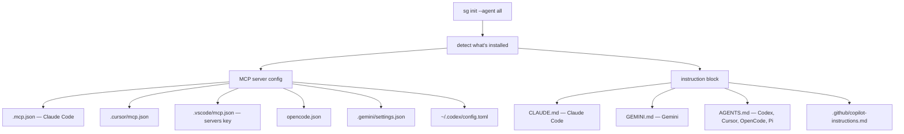
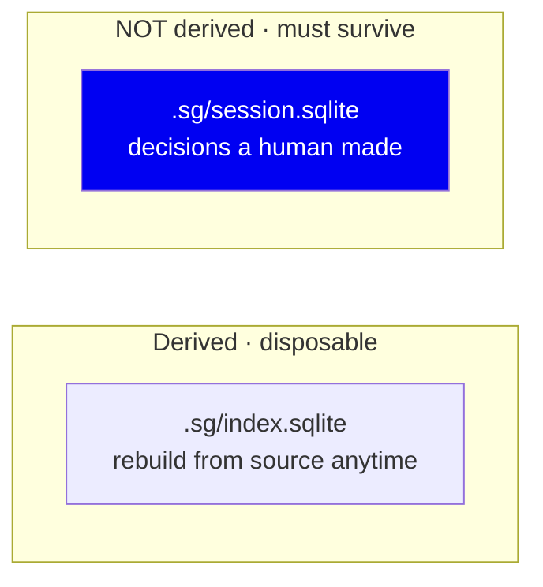

# 11 · Serving over MCP

**Phase 12.** How an AI agent actually consumes any of this.

---

## The problem

We have a fast, accurate local index. An agent running in Claude Code, Cursor
or VS Code has no idea it exists.

Options for bridging that gap:

| Approach | Problem |
|---|---|
| Tell the user to run `sg search` and paste results | Manual, breaks flow, agent can't act on its own |
| A prompt instructing the agent to shell out to `sg` | Fragile — depends on the agent having shell access and parsing our stdout |
| An HTTP API | The agent needs to know the URL, and something must run a server |
| **MCP (Model Context Protocol)** ✅ | Purpose-built: a standard way to expose tools to an agent |

MCP is the answer to exactly this problem, so we use it.

---

## Architecture



Two front ends, one index:

- **`sg`** — the CLI, for humans and for debugging
- **`sg-mcp`** — the MCP server, for agents

The MCP server is a **thin wrapper**. Every tool it exposes maps to the same
functions the CLI calls. This is deliberate: if a search misbehaves for an
agent, you reproduce it with `sg search` in a terminal. One code path, two
surfaces.

**Transport is stdio, not HTTP.** The agent launches `sg-mcp` as a subprocess
and talks JSON-RPC over stdin/stdout. No port, no bind address, no auth, no
listening socket on a developer machine. For a local tool this is strictly
safer and simpler.

---

## The 15 tools



### Why this granularity?

We could have exposed one `query` tool. We didn't, because **tool names are
part of the prompt.** An agent chooses tools by reading their names and
descriptions. `callers(name)` tells the model exactly when to reach for it;
a single `query(string)` makes the model guess phrasing and hope our intent
regex catches it.

Narrow, well-named tools turn our [08](08-retrieval.md) intent-detection
problem into the agent's job — and the agent is much better at it than a regex.

**Tradeoff:** 15 tools consume context in the agent's tool list. That's a real
cost, paid once per session, against better tool selection on every call.

---

## Zero-config setup

`sg init --agent all` detects installed agents and, for each, writes both the
MCP config **and** the instruction block into the file that agent reads:



Registering the server is only half the job. An agent holding fifteen tools it
was never told about keeps grepping — measured at zero tool calls across nine
runs. The instruction block is what moves it. Each agent gets the block in the
file it actually loads: Claude Code reads `CLAUDE.md` and does **not** read
`AGENTS.md`, which is why writing only the latter looked like a no-op.

Real output on this repo:

```
$ sg init --agent all
Wrote .mcp.json
Wrote CLAUDE.md
Wrote .cursor/mcp.json
Wrote AGENTS.md
Wrote .vscode/mcp.json
Wrote .github/copilot-instructions.md
Wrote opencode.json
Wrote .gemini/settings.json
Wrote GEMINI.md
Wrote ~/.codex/config.toml

Next: run `sg index .`, then restart your editor so it picks
up the MCP server. `sg doctor .` verifies both halves are wired.
```

The config itself is trivial:

```json
{ "mcpServers": { "symbolgraph": { "command": "sg-mcp" } } }
```

### Idempotency is a hard requirement

`sg init` must be safe to run repeatedly — it's wired into git hooks and users
will re-run it. That means:

- **Never clobber** an existing config; merge into it
- **Detect** an existing correct entry and report `already configured`
- **Atomic writes** (`symbolgraph/editors.py:169`) — write to a temp file,
  `fsync`, then `os.replace`. A crash mid-write must not leave a user's
  `settings.json` truncated. Corrupting an editor config is a serious failure
  for a tool that's supposed to be helpful.
- **Versioned blocks** (`<!-- sg-block-version:1 -->`) in Markdown files, so a
  future version can find and update its own section without touching the
  user's prose.

TOML (`~/.codex/config.toml`) needs its own escaping path, which is why
`toml_escape` exists and is tested separately.

---

## Session memory — the one non-derived thing

Seven of the fifteen tools are session memory: `record_decision`,
`session_recall`, `session_timeline`, and friends.

This is a different kind of data from everything else in the system:



*"We chose SQLite over Postgres because we need zero-install"* cannot be
recovered by re-parsing the repository. It exists only because someone recorded
it.

That's why it lives in a **separate database file**. The index can be dropped
and rebuilt on a schema bump ([06](06-storage.md)); session memory must not be.
Mixing them would eventually destroy user data on a routine version upgrade.

Session memory is bounded and redacted for the same reason as ingestion:
`MAX_TEXT = 2000`, and every stored string passes through
`redact_secrets` + `redact_pii`. Raw source and raw tool output are never
stored. `sg sessions prune --days 30` and `rm -rf .sg/session.sqlite` are the
documented escapes.

---

## Operational concerns

An MCP server is a long-lived process launched by the editor, which creates
problems a CLI doesn't have:

| Concern | Mechanism |
|---|---|
| Idle memory | `IdleTracker`, 30 min — every tool call touches it, so the server knows when it's unused |
| Memory pressure | `is_memory_pressured()` reads Linux PSI; embedding batch size halves under pressure |
| Thread explosion | `SG_ORT_THREADS` caps ONNX runtime threads — an editor already runs many processes |
| Concurrent writes | `ProjectIndexLock` — a CLI `sg index` and the MCP server must not both write |

These exist because the server runs *inside someone's editor*. A CLI that hogs
8 threads for 10 seconds is fine; a background server that does it makes the
whole machine feel slow, and the user blames the editor.

---

## Summary

| Decision | Why | Cost |
|---|---|---|
| MCP over a custom protocol | It's the standard for exposing tools to agents | Depends on MCP's evolution |
| stdio, not HTTP | No port, no auth, no listening socket | One process per client |
| 15 narrow tools | Tool names guide selection better than one generic tool | Consumes agent context |
| MCP wraps the same functions as the CLI | Reproduce any agent bug in a terminal | Thin indirection layer |
| Atomic, idempotent, merging config writes | Corrupting an editor config is unforgivable | More care per writer |
| Session memory in a separate DB | It is **not** derived and must survive rebuilds | Two databases |
| Idle + memory + thread governors | It runs inside the user's editor | Extra operational code |

**Next:** [12 · Evaluation](12-evaluation.md)
