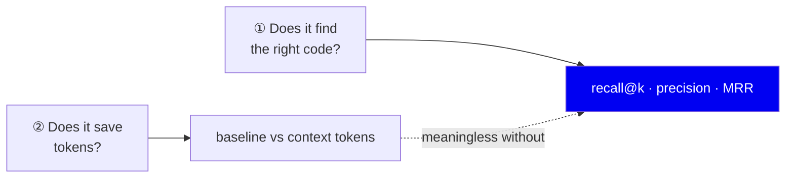
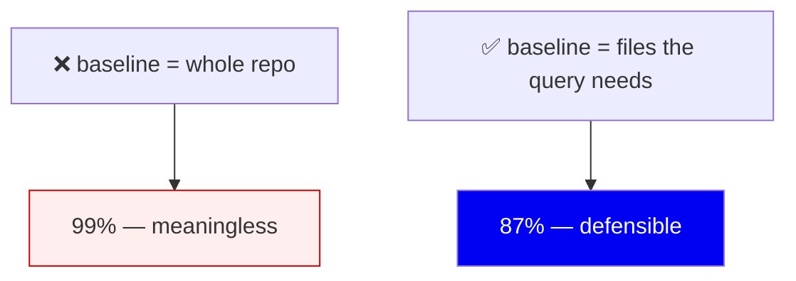
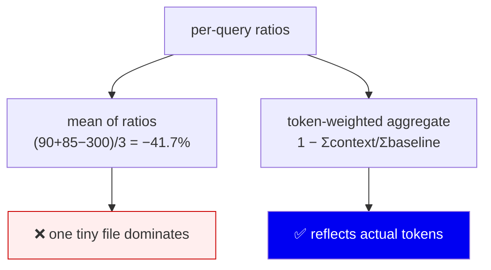
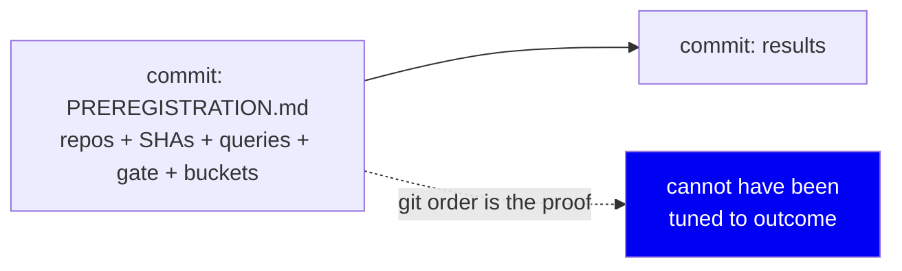
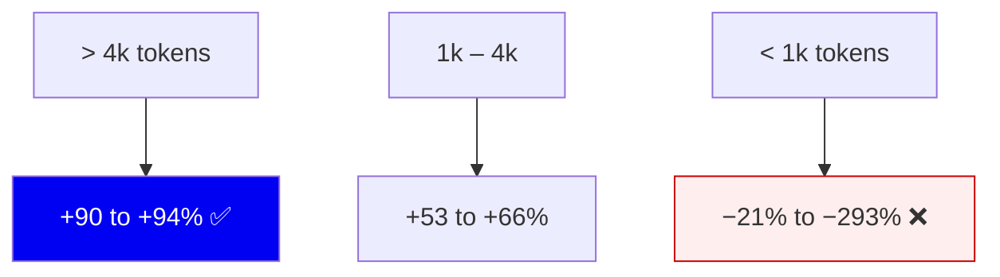
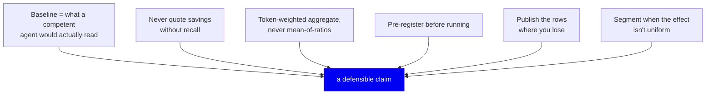

# 12 · Evaluation — how we measure without lying to ourselves

**The last phase, and arguably the most important.** A retrieval system that
can't prove it works is a demo.

---

## The problem

Retrieval quality claims are extraordinarily easy to fake — usually by
accident, not malice:

- Pick the benchmark **after** seeing which one flatters you
- Write queries **while looking at** what your system happens to retrieve well
- Report **savings** without reporting whether you still found the right answer
- Compare against a **baseline nobody would actually use**
- Average in a way that **hides** the cases where you lose

Every one of these produces a number that is technically computed correctly and
completely meaningless. This document is about the guardrails.

---

## Two different questions



The dotted line is the point. **A savings number without a recall number is
worthless** — I can save you 100% of your tokens by returning nothing.

---

## Question 1 — retrieval quality

Measured on `tests/fixtures/evaluation_repo`, a self-authored fixture with
known correct answers. `sg eval --embed`:

| Metric | FTS + graph | With vectors |
|---|---|---|
| Definition accuracy | 0.83 | **0.92** |
| Mean recall@5 | 0.78 | **0.97** |
| MRR | 0.71 | **0.94** |

Two things this table is designed to show:

1. **The no-model column is published first.** Most users won't install Ollama,
   so `0.83 / 0.78` is what they actually get. Leading with the vector column
   would advertise a configuration most people don't run.
2. There's a **regression gate** in `tests/test_evaluation_metrics.py` — if
   definition accuracy drops below `0.83`, the test suite fails. A quality
   metric that isn't enforced drifts.

**Weakness, stated plainly:** this fixture is self-authored, so it can only
catch regressions — it cannot prove the system is good in general. That's what
question 2's external repos are for.

---

## Question 2 — token savings, and the traps

### Trap 1: the dishonest baseline

The tempting comparison:

```
whole repo (500,000 tokens) → context pack (800 tokens) = 99.8% saved!
```

**This is meaningless.** Nobody pastes an entire repository into a prompt. The
baseline must be what a competent agent would *actually* do: read the files the
query needs.

We enforce this in code. `evaluation/runner.py` **hard-codes the whole-repo
reduction to `0.0`** specifically so nobody can accidentally report it. The
real baseline is `expected_files` content only
(`evaluation/external.py`).



### Trap 2: mean-of-ratios

Given per-query savings of `+90%, +85%, −300%`, what's the average?



Mean-of-ratios weights a 100-token file the same as a 20,000-token file. A few
tiny files where the pack overhead dominates can swing it wildly negative even
when the set saves enormous real token volume.

**This is not hypothetical.** On FastAPI:

| Metric | Value |
|---|---|
| `mean_savings_pct` (mean of ratios) | **−1268%** |
| `aggregate_savings_pct` (token-weighted) | **+83.1%** |

Same run. Both computed correctly. One is useful.

We report `aggregate_savings_pct`, and
`tests/test_external_eval.py::test_aggregate_savings_is_token_weighted_not_mean_of_ratios`
constructs a deliberately skewed scenario to pin that they can disagree in
sign — so nobody "simplifies" the code back to the wrong one.

### Trap 3: choosing the benchmark after seeing results

The most insidious trap, because it doesn't feel like cheating. You run three
repos, one looks bad, you decide it "wasn't representative".

**Defence: pre-registration.** Before the first run, committed to git:



`benchmarks/PREREGISTRATION.md` fixes, in advance:

- **Which repos** and their exact commit SHAs (Django, Fiber, FastAPI)
- **The queries** — 20 per repo, written by reading the code, without looking
  at file sizes
- **The recall gate** — `mean_recall_at_10 >= 0.90` to headline a repo
- **The size buckets** — `<1k`, `1k-4k`, `>4k`
- **That every repo publishes whatever it returns**
- **What would falsify the claim** — if the `>4k` bucket didn't clear ~60%,
  "savings scale with size" is wrong and the honest output is a negative result

The git history is the evidence. Queries were committed *before* results
existed, so they demonstrably weren't reverse-engineered from what worked.

---

## The result

**87.2% fewer context tokens across 60 queries, at recall@10 = 0.95.**

Reproduce with `sg savings` (the `(pooled)` row):

| | |
|---|---|
| Questions | 60 (20 × 3 repos) |
| Baseline tokens | 382,064 |
| Context tokens | 48,925 |
| **Pooled aggregate** | **87.2%** |
| Mean recall@10 | 0.95 |

Pooled over **individual questions**, not averaged across the three repos'
percentages (that would be 86.3%) — averaging percentages weights a repo of
small files the same as one of large files.

Per repo, all clearing the pre-declared gate:

| Repo | Tokens/query | Saving | Recall@10 |
|---|---|---|---|
| Django | 8,909 → 811 | 90.9% | 1.00 |
| Fiber | 5,272 → 804 | 84.7% | 0.95 |
| FastAPI | 4,923 → 831 | 83.1% | 0.90 |

### And the segmented finding, which matters more



We publish the losing rows. They are what make the winning rows credible, and
they tell you honestly when not to use this.

The pooled number is pinned by `tests/test_pricing.py::TestPooledClaim`, which
asserts 87.2% / 0.95 / n=60 and that the figure differs from mean-of-
percentages — so the published claim cannot silently drift from the data.

---

## Scope: what this number is *not*

**This measures retrieved context size, not an agent's end-to-end cost to
finish a task.**

The honest phrasing is *"87% fewer context tokens"*, never *"87% cheaper
agents"*. Proving the latter needs paired A/B agent runs on real tasks, which
we have infrastructure for (`evaluation/ab_runner.py`,
`scripts/ab_agent_cmd.py`) but have not run at scale.

Dollars are a **projection, not a measurement**: input tokens only, at a stated
model price with a stated date (`retrieval/pricing.py`, `2026-06-24`). Always
rendered with model + price + date, never as a bare "$X".

---

## The rules, extracted



The project's own engineering rule, from `CONTRIBUTING.md`:

> **If you can't point to the line and the test, it isn't done.**

Applied to measurement: if you can't point to the command that produced a
number, don't publish the number.

---

## Summary

| Guardrail | Prevents |
|---|---|
| Whole-repo baseline hard-coded to 0.0 | The fake 99% |
| Recall gate at 0.90 | "Savings" from returning less |
| Token-weighted aggregate | One tiny file swinging the headline |
| Pre-registered repos/queries/SHAs | Choosing the benchmark after seeing results |
| Negative buckets published | Hiding where it doesn't work |
| Claim pinned by test | Published numbers drifting from data |
| Regression gate on the fixture | Silent quality decay |
| "Context tokens", not "cheaper agents" | Overclaiming scope |

---

**← Back to [the index](README.md)**
