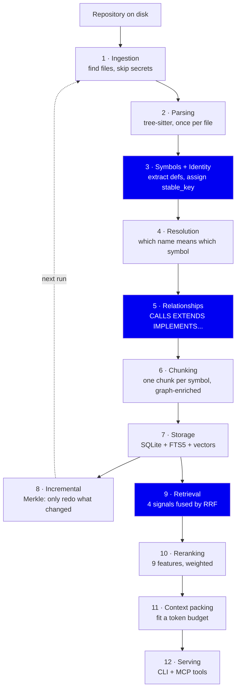

# symbolgraph — Architecture, from first principles

This folder explains **what symbolgraph does, why it is built this way, and what
we gave up to build it this way**. It is written for an engineer who is new to
the codebase and wants to understand the reasoning, not just the call graph.

Every document follows the same shape:

1. **The problem** — what breaks if this stage doesn't exist.
2. **First principles** — reasoning from what is actually true about code,
   before reaching for a library.
3. **What we built** — the real implementation, with file references.
4. **Alternatives** — what else we could have used, and why we didn't.
5. **Tradeoffs** — what this choice costs us.

File references look like `analysis/pipeline.py:42`. They are real; open them.

---

## The one-paragraph version

An AI coding agent asked *"where does login happen?"* will grep, open six
files, and spend thousands of tokens rebuilding context that already exists on
disk. symbolgraph reads the repository once, extracts every **symbol** (function,
class, method) and the **typed relationships** between them (calls, extends,
implements), stores it all in one local SQLite file, and answers questions with
*the definition you needed plus the things connected to it* — inside a token
budget.

---

## The pipeline

Stages 1–8 are the **write path** (indexing). Stages 9–12 are the **read path**
(answering a question). They meet at storage.

---

## Reading order

| # | Document | What you'll understand |
|---|---|---|
| 00 | [Why a symbol graph](01-why-symbol-graph.md) | The core thesis, and why chunking loses information |
| 01 | [Ingestion & parsing](02-ingestion-and-parsing.md) | Finding files, the "parse once" rule |
| 02 | [Symbols & identity](03-symbols-and-identity.md) | `stable_key` — why identity is the hard part |
| 03 | [Resolution & relationships](04-resolution-and-relationships.md) | Scope climbing, imports, typed edges |
| 04 | [Chunking & embedding](05-chunking-and-embedding.md) | Why our chunks aren't just source code |
| 05 | [Storage](06-storage.md) | One SQLite file, three indexes, why not a real DB |
| 06 | [Incremental indexing](07-incremental-indexing.md) | Merkle hashing, interface fingerprints |
| 07 | [Retrieval](08-retrieval.md) | Hybrid search and Reciprocal Rank Fusion |
| 08 | [Reranking](09-reranking.md) | The 9 features and what each is for |
| 09 | [Context packing](10-context-packing.md) | Turning results into a token-budgeted answer |
| 10 | [Serving over MCP](11-serving-mcp.md) | How an agent actually consumes this |
| 11 | [Evaluation](12-evaluation.md) | How we measure, and how we avoid lying to ourselves |

---

## The three ideas that explain most decisions

If you remember nothing else:

**1. A symbol is the unit, not a text span.**
Code has structure that the language itself defines. Splitting on token counts
throws that away. Everything in the write path exists to preserve it.

**2. Identity must survive edits.**
If a symbol's identity changes when you add a blank line above it, incremental
indexing is impossible and every edit invalidates the world. `stable_key`
(`analysis/fingerprints.py:14`) is load-bearing for the entire system.

**3. Retrieval is a ranking problem, not a lookup problem.**
No single signal is right. Exact match misses paraphrases; vectors miss exact
names; graph misses unrelated-but-relevant code. We run four and fuse them.
